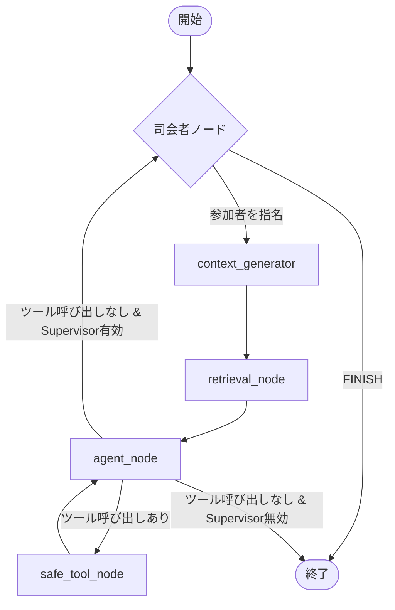

# Supervisor機能（AI自動進行モード）仕様書

## 概要
Supervisor機能は、グループ会話において**AIが自律的に次の発言者を決定する**機能です。LangGraphの「Supervisorパターン」を実装し、会話の文脈を読んで最適な参加者を指名します。

## UI設定
- **ラベル**: 「AI自動進行（司会モード）」
- **場所**: 左カラム → 「🧑‍🤝‍🧑 グループ会話」アコーディオン内
- **デフォルト**: **オフ**

## アーキテクチャ



## 動作フロー

### Supervisor有効時
1. **Supervisorノード**が会話履歴を分析
2. 次の発言者を決定（参加者リスト or "FINISH"）
3. 指名された参加者の`context_generator` → `agent`が実行
4. 応答後、再びSupervisorへ制御を返す
5. Supervisorが"FINISH"を選択するまでループ

### Supervisor無効時（デフォルト）
1. 従来通りの1ターン制会話
2. エージェントが応答後、即座に終了

## 実装詳細

### 関連ファイル
| ファイル | 変更内容 |
|----------|----------|
| `agent/graph.py` | `supervisor_node`、ルーティング関数、ワークフロー定義 |
| `constants.py` | `SUPERVISOR_MODEL = "gemma-3-12b-it"` |
| `nexus_ark.py` | UIチェックボックス（`enable_supervisor_cb`） |
| `ui_handlers.py` | ハンドラへの引数追加 |
| `gemini_api.py` | 初期状態への`enable_supervisor`フラグ追加 |

### AgentState
```python
class AgentState(TypedDict):
    # ... 既存フィールド ...
    next: str                   # Supervisorの決定（次の話者 or "FINISH"）
    enable_supervisor: bool     # Supervisor機能の有効/無効
```

### supervisor_node
- **目的**: 次の発言者を決定
- **使用モデル**: `gemma-3-12b-it`
- **出力形式**: JSON (`{"next_speaker": "選択した名前"}`)
- **選択肢**: 参加者リスト + "FINISH"

### route_after_agent
```python
def route_after_agent(state):
    if state.get("force_end"): return "__end__"
    if last_message.tool_calls: return "safe_tool_node"
    if not state.get("enable_supervisor", False): return "__end__"  # ★重要
    return "supervisor"
```

## 注意事項

> [!IMPORTANT]
> Supervisor無効時に`route_after_agent`が`supervisor`に戻すと**無限ループ**が発生します。
> 必ず`enable_supervisor`フラグをチェックしてください。

## 使用モデルの選定理由

| 候補 | 採用 | 理由 |
|------|------|------|
| `gemma-3-12b-it` | ✅ | 軽量・高速・無料枠で十分な判断能力 |
| `gemma-3-27b-it` | △ | より高精度だが速度がやや劣る |
| `gemini-2.5-flash` | ❌ | RPM制限が厳しい（10 RPM） |

## 今後の拡張可能性
- 会話の「温度」や「盛り上がり」に基づく動的な指名ロジック
- ユーザーが明示的に指名できるUIの追加
- Supervisorのプロンプトカスタマイズ機能
