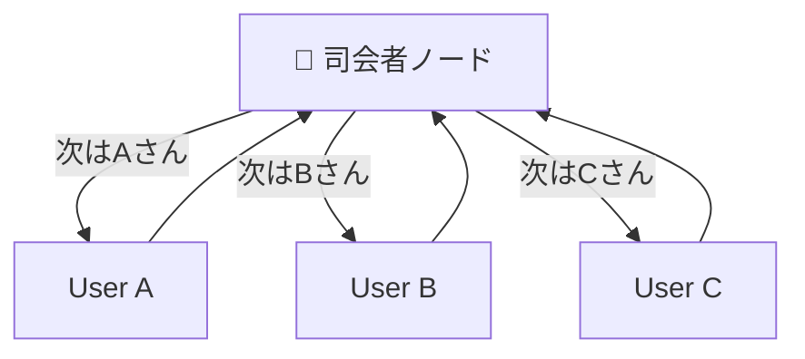

# LangGraph Multi-Agent Orchestration (Supervisor Pattern)

## 概要
LangGraphの**マルチエージェント機能**、特に**「Supervisor（監督者）」パターン**は、グループ会話における「発言権の管理」や「ターン制御」を実現するための最適なアーキテクチャです。

このパターンを使用することで、現在の単一エージェントループを拡張し、AIが自律的に「次は誰が話すべきか」を判断するグループ会話システムを構築できます。

## Supervisorパターンの仕組み
Supervisorパターンでは、会話の流れを整理する「司会者（Supervisor）」という専用のAIノードを配置し、以下のような星型のグラフ構造を作ります。



1.  **状況判断**: Supervisorは会話履歴全体を見て、「次は誰が話すべきか（または議論終了か）」を判断します。
2.  **指名と実行**: 指名されたエージェント（ノード）だけが実行され、発言を行います。
3.  **制御の返還**: エージェントは発言後、再びSupervisorに制御を戻します。
4.  **終了判定**: Supervisorが「FINISH」を選択すると、ユーザーへの応答として処理を終了します。

## Nexus Arkへの実装案

現在のお客様のシステム（`agent/graph.py`）は動的にルーム（ペルソナ）をロードする仕組みを持っているため、以下のような拡張が可能です。

### 1. Supervisorノードの定義
「次の話者」を出力するツール（Structured Output）を持つ軽量なLLMをSupervisorとして定義します。

```python
from typing import Literal
from langchain_core.pydantic_v1 import BaseModel

def supervisor_node(state):
    # 現在の参加者リストを取得
    participants = state.get("all_participants", [])
    options = participants + ["FINISH"]
    
    # 構造化出力の定義
    class RouteResponse(BaseModel):
        next_speaker: Literal[*options]

    # 司会者のプロンプト
    system_prompt = (
        "あなたはグループチャットの管理役です。"
        "これまでの会話の流れを見て、次に発言すべき担当者を選んでください。"
        "ユーザーからの問いかけであれば、最も適した担当者を指名してください。"
        "全員の意見が出尽くしたり、会話が一段落したら 'FINISH' を選んでください。"
    )
    
    # AIによる判断
    response = llm.with_structured_output(RouteResponse).invoke(
        [SystemMessage(content=system_prompt)] + state["messages"]
    )
    return {"next": response.next_speaker}
```

### 2. グラフの更新
`agent/graph.py` の条件付きエッジを更新し、Supervisorの決定に基づいてループするようにします。

```python
# 条件付きエッジ（Supervisorの決定で分岐）
workflow.add_conditional_edges(
    "supervisor",
    lambda x: x["next"],
    {
        "ParticipantA": "agent_node_A", # ※実際には動的ロードの仕組みと組み合わせます
        "ParticipantB": "agent_node_B",
        "FINISH": END
    }
)
```

## メリット
*   **自律的な進行**: 「Aさんが発言したら次は必ずBさん」といった固定ルールではなく、文脈に合わせて「Aさんが連続で話す」「Cさんが割って入る」といった自然な会話が可能になります。
*   **会話の抑制**: 「もう話すことがない」とＡＩが判断すれば、無駄なラリーを続けずに終了できます。

## 推奨される進め方
まずは現在の `agent/graph.py` とは別に、実験用のブランチまたは別ファイルでこのSupervisorロジックをプロトタイピングし、現在のNexus Arkの「動的ペルソナロード」の仕組みとうまく噛み合うか検証することをお勧めします。

## Supervisor用 推奨軽量モデル（2025年12月時点）
コスト効率と構造化出力の精度を両立するモデルの選定リストです。

### 1. 【Groq】Llama 3.1 8B (Instant)
*   **モデル名**: `llama-3.1-8b-instant`
*   **推奨理由**: **最速かつ無料枠あり**。会話の合間に挟むSupervisorには、ユーザーを待たせないための「速度」が命です。Groqの推論速度であれば、司会者が入ってもラグを感じさせません。Function Calling精度も高く、第一候補です。

### 2. 【OpenRouter】Google Gemini 2.0 Flash (Experimental)
*   **モデル名**: `google/gemini-2.0-flash-exp:free` (※OpenRouter上の名称)
*   **推奨理由**: Googleの最新実験モデルは無料開放されていることが多く、プロバイダを経由しても非常に高速で高性能です。JSON出力の安定感は随一です。

### 3. 【OpenRouter】Mistral Small 3 / Ministral 8B
*   **モデル名**: `mistralai/mistral-small-24b-instruct-2501:free` 等
*   **推奨理由**: Mistral系は「Instruction Following（指示順守）」能力が高く、短いプロンプトで淡々と役割をこなすSupervisorに向いています。Llama 3系でJSONエラーが出る場合の代替候補として優秀です。

### 4. 【Google AI Studio】Gemma 3 (4B / 12B / 27B)
*   **特徴**: Googleの最新オープンモデル。Gemini 2.0の技術を継承し、Function Callingに公式対応しています。
*   **Supervisor適正**: **非常に高い**。特に軽量な4B/12Bモデルは、単純なルーティング判断には十分な賢さを持ち、かつ高速です。
*   **注意点**: Google AI Studioの無料枠では「1分間に15リクエスト(RPM)」等の制限があるため、会話が高速で連鎖すると制限に達する可能性があります。Groq等の他プロバイダとの併用運用が推奨されます。

## 内部処理モデルとしての適正比較
ユーザーからの質問に基づき、`INTERNAL_PROCESSING_MODEL`（情景描写や検索クエリ生成を担当）としてGemma 3が使えるかを検討しました。

### 結論：非推奨（現状維持がベスト）
以下の理由から、内部処理用にはGemma 3ではなく、引き続き `gemini-2.5-flash-lite`（またはGemini 2.0 Flash Exp）を使用することを推奨します。

1.  **レート制限の壁**: 内部処理は1回のターンで複数回（情景生成＋検索判断など）呼ばれることがあり、Gemma 3 (Google AI Studio) の **15 RPM制限** に接触するリスクが非常に高いです。
2.  **表現力の差**: 情景描写のようなクリエイティブなタスクでは、パラメータ数の大きいGeminiモデルの方が表現力が豊かで、空気感のある文章を生成できます。
3.  **役割分担**:
    *   **Supervisor**: 選択肢を選ぶだけの単純タスク → Gemma 3 (4B/12B) や Llama 3 (8B) が最適。
    *   **Internal Processing**: 文章生成や文脈推論が必要なタスク → Gemini 2.5 Flash Lite が最適。
