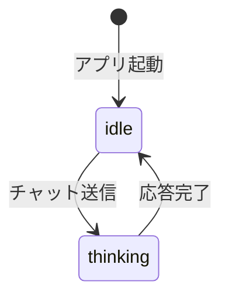

# 動画アバター仕様書

> 最終更新: 2025-12-26

---

## 概要

ペルソナのプロフィール表示に動画（mp4, webm, gif）を使用できる機能。
AI応答生成中は「思考中」の動画に自動切り替えし、完了すると「待機」に戻る。

---

## ファイル構成

```
characters/[ルーム名]/
├── profile.png          # 静止画モード用
└── avatar/
    ├── idle.mp4         # 待機状態（ループ再生）
    └── thinking.mp4     # 思考中状態（AI応答生成中）
```

**対応フォーマット:** mp4, webm, gif

---

## 動作仕様

### アバターモード

| モード | 説明 |
|--------|------|
| 静止画 | `profile.png` を表示（従来方式） |
| 動画 | `avatar/idle.mp4` を優先表示、なければ `profile.png` にフォールバック |

モード設定はルームごとに保存される。

### 状態遷移



- **idle**: 待機状態。ユーザーの入力待ち。
- **thinking**: AI応答生成中。ストリーミング開始から完了まで。

---

## UI操作

1. サイドバーの「🖼️ プロフィール・情景」アコーディオンを開く
2. 「アバターを変更」を開く
3. モードを選択（静止画 / 動画）
4. 「待機アバターをアップロード」で `idle.mp4` を設定
5. 「思考中アバターをアップロード」で `thinking.mp4` を設定

---

## 技術詳細

### 表示方式
- `gr.HTML` を使用し、base64エンコードした動画を `<video>` タグで埋め込み
- `autoplay loop muted playsinline` 属性でシームレスなループ再生

### スタイル
```css
width: 100%; 
height: 200px; 
object-fit: contain;  /* 画像を切り取らず全体表示 */
border-radius: 12px;
```

### 関連関数

| 関数 | ファイル | 役割 |
|------|----------|------|
| `get_avatar_html()` | ui_handlers.py | アバターHTML生成 |
| `handle_avatar_upload()` | ui_handlers.py | 待機アバターアップロード処理 |
| `handle_thinking_avatar_upload()` | ui_handlers.py | 思考中アバターアップロード処理 |
| `handle_avatar_mode_change()` | ui_handlers.py | モード切り替え処理 |

---

## 将来拡張（予定）

- [ ] talking状態（発話中）の追加
- [ ] 感情メタデータに基づく表情変化
- [ ] 複数表情パターンのランダム選択
