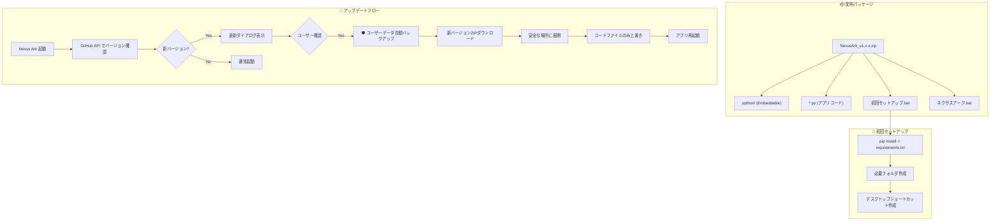

# Nexus Ark 配布・更新システム実装計画

## 背景と目的

Nexus Arkを非技術者向けに広く一般公開するための、ワンクリックインストール・安全なアップデート機構を設計・実装する。

### 確認済み情報

| 項目 | 内容 |
|------|------|
| GitHubリポジトリ | `kenomendako/Nexus-Ark` |
| 会話ログ場所 | `characters/{ルーム名}/log.txt` |
| 案内役 | オリヴェ（仕様書ナレッジで使い方を説明） |

---

## 🔧 Portable Python についてのアドバイス

調査の結果、配布方式には3つの選択肢があります。**私のおすすめは「方式A: Portable Python同梱」**です。

### 方式比較

| 方式 | 配布サイズ | セットアップ | 更新の容易さ | リスク |
|------|-----------|-------------|-------------|--------|
| **A: Portable Python同梱** | 約150-200MB | ダブルクリック | ◎ 簡単 | 低 |
| B: PyInstaller exe化 | 約300-500MB | ダブルクリック | △ 毎回全体再ビルド | 中（ウイルス誤検知） |
| C: ユーザーにPythonインストールさせる | 約20MB | 複雑 | ◎ 簡単 | 高（エラー多発） |

### 推奨: 方式A（Portable Python同梱）

**理由:**
1. **セットアップ簡単**: ユーザーはZIP解凍→バッチ実行だけ
2. **更新が柔軟**: Pythonファイルだけ差し替えれば更新完了
3. **トラブル対応しやすい**: ソースコードがそのまま見えるので問題調査が容易
4. **ウイルス誤検知なし**: exe化しないので安全

**デメリット（許容範囲）:**
- 配布サイズが150-200MB程度になる（現代の回線速度なら問題なし）

---

## オリヴェ・ナレッジ更新戦略

> [!NOTE]
> **提案: ナレッジファイルのバージョン管理**
> 
> オリヴェが参照する仕様書ナレッジを、更新時に自動で最新版に差し替える仕組みを追加します。

**方針:**
1. ナレッジファイル（仕様書等）は**上書き対象**に含める
2. ユーザー作成のナレッジがある場合は**名前で区別**して保護
3. `version.json`にナレッジバージョンも記載し、必要時のみ更新

---

## 提案アーキテクチャ



---

## Proposed Changes

### Core Infrastructure

#### [NEW] [version.json](../../version.json)

バージョン管理用ファイル。GitHubリリースとの照合に使用。

```json
{
  "version": "1.0.0",
  "release_date": "2025-12-16",
  "min_python_version": "3.10",
  "github_repo": "kenomendako/Nexus-Ark",
  "knowledge_version": "1.0.0"
}
```

---

#### [NEW] [初回セットアップ.bat](../../初回セットアップ.bat)

ユーザーがダブルクリックするだけでセットアップ完了するスクリプト。

**機能:**
- 同梱のPortable Pythonで依存関係インストール
- 必要フォルダの作成
- デスクトップショートカットの作成（オプション）
- 完了メッセージ表示

---

#### [NEW] [update_manager.py](../../update_manager.py)

アップデート確認・実行を管理するモジュール。

**主要関数:**
- `check_for_updates()`: GitHub APIで最新リリースを確認
- `download_update()`: 新バージョンZIPをダウンロード
- `backup_user_data()`: ユーザーデータを安全にバックアップ
- `apply_update()`: コードファイルのみ上書き
- `get_protected_paths()`: 保護対象パス一覧を返す

---

#### [MODIFY] [nexus_ark.py](../../nexus_ark.py)

起動時のアップデート確認UI追加。

**変更内容:**
- 起動時に`update_manager.check_for_updates()`を呼び出し
- 更新がある場合、Gradioの情報ダイアログで通知
- 「今すぐ更新」ボタンでワンクリック更新開始

---

#### [MODIFY] [ネクサスアーク.bat](../../ネクサスアーク.bat)

Portable Python対応に修正。

```diff
-if exist "venv\Scripts\python.exe" (
+if exist "python\python.exe" (
+    echo [INFO] Portable Python found.
+    "python\python.exe" nexus_ark.py
+) else if exist "venv\Scripts\python.exe" (
     echo [INFO] Virtual Environment found.
     "venv\Scripts\python.exe" nexus_ark.py
 ) else (
```

---

### GitHub Integration

#### [NEW] [.github/workflows/release.yml](../../.github/workflows/release.yml)

（**将来オプション**）タグプッシュ時に自動でリリースZIPを作成するワークフロー。

初期段階では手動リリースで運用し、安定したら自動化。

---

## データ保護戦略

### 保護対象ファイル一覧

| パス | 説明 | 保護レベル |
|------|------|-----------|
| `config.json` | 全設定情報 | 🔴 絶対上書き禁止 |
| `characters/` | キャラクター・会話ログ全て | 🔴 絶対上書き禁止 |
| `characters/*/log.txt` | 会話履歴 | 🔴 絶対上書き禁止 |
| `alarms.json` | アラーム設定 | 🔴 絶対上書き禁止 |
| `backups/` | バックアップデータ | 🔴 絶対上書き禁止 |
| `themes/` | カスタムテーマ | 🟡 ユーザー作成分のみ保護 |
| `assets/` | ユーザー追加画像等 | 🟡 ユーザー追加分のみ保護 |

### バックアップ戦略

1. **アップデート前自動バックアップ**
   - `backups/pre_update_YYYYMMDD_HHMMSS/` に全保護対象をコピー
   - 直近5回分を保持、古いものは自動削除

2. **ロールバック機能**
   - 更新失敗時は自動でバックアップから復元
   - 手動ロールバックもUIから可能

---

## Verification Plan

### 自動テスト

このプロジェクトには現在テストフレームワークが設定されていないため、新規テストの追加は本フェーズでは行いません。

### 手動検証

#### 検証1: 初回セットアップ確認

1. 新しいフォルダに配布ZIPを展開
2. `初回セットアップ.bat` をダブルクリック
3. **確認ポイント:**
   - エラーなく完了メッセージが表示される
   - `python/Lib/site-packages/` に依存関係がインストールされている
   - `ネクサスアーク.bat` でアプリが起動する

#### 検証2: アップデート確認機能

1. `version.json` のバージョンを古い値（例: `0.9.0`）に変更
2. アプリを起動
3. **確認ポイント:**
   - 「新しいバージョンが利用可能です」というダイアログが表示される
   - 「後で」を選択すると通常起動する
   - ダイアログは次回起動時にも再表示される

#### 検証3: ユーザーデータ保護

1. テスト用の `config.json` と `characters/test_char/` を作成
2. モックアップデートを実行（テストモード）
3. **確認ポイント:**
   - `config.json` の内容が**変更されていない**
   - `characters/test_char/` が**削除されていない**
   - `backups/pre_update_*/` にバックアップが作成されている

#### 検証4: 起動スクリプト

1. `python/` フォルダが存在する状態で `ネクサスアーク.bat` を実行
2. `python/` フォルダを削除し、`venv/` がある状態で実行
3. 両方がない状態で実行
4. **確認ポイント:**
   - 各ケースで適切なPythonが使用される
   - エラーメッセージが適切に表示される

---

## 実装フェーズ

計画承認後、以下の順序で実装を進めます：

1. **Phase 1**: `version.json` 作成とバージョン管理基盤
2. **Phase 2**: `update_manager.py` 実装（バックアップ・確認機能）
3. **Phase 3**: `初回セットアップ.bat` 作成
4. **Phase 4**: `nexus_ark.py` にUI統合
5. **Phase 5**: `ネクサスアーク.bat` 修正
6. **Phase 6**: 手動検証とドキュメント作成


