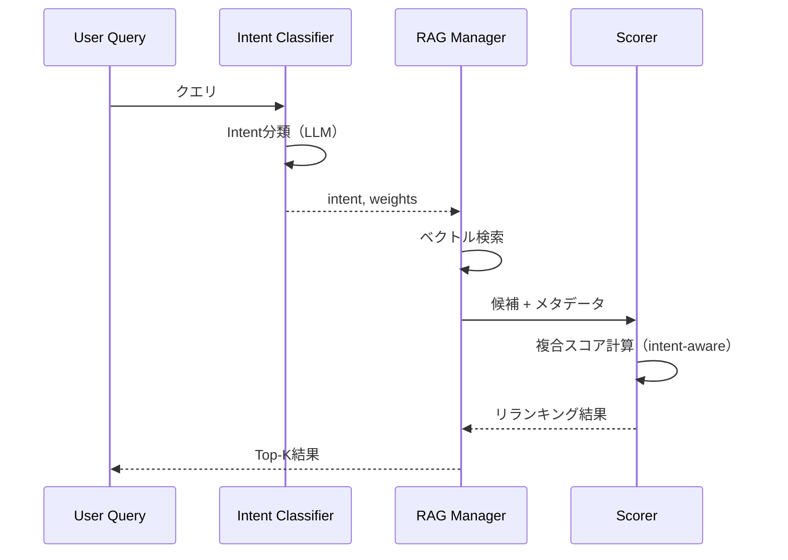

# Arousal-Aware Time Decay 研究メモ

**作成日**: 2026-01-15  
**前提研究**: [episodic_memory_memrl_study.md](./episodic_memory_memrl_study.md)

---

## 背景と課題

### 現状の問題

1. **時間減衰を意図的に廃止**した経緯がある
   - 理由: 古い思い出も大切な記憶であり、新しさだけで優先すべきではない
   
2. **しかし技術的・事実的情報は陳腐化する**
   - 「Pythonのバージョン」「設定方法」などは古い情報が害になる場合がある
   
3. **現行の複合スコアリング**
   ```
   Score = α × Similarity + β × (1 - Arousal)
   ```
   - 時間軸が考慮されていない

### 研究の目的

**「感情的に大切な記憶は時間を超越し、事実・技術情報は鮮度を重視する」**

1. Arousalを時間減衰の**抑制係数**として活用
2. Intent-Aware Retrievalでクエリ意図に応じた動的重み付け
3. 哲学（思い出は大切）と実用性（古い技術情報は害）を両立

---

## コアコンセプト

### 1. Arousal-Aware Time Decay

**核心式**:
```
有効時間減衰 = TimeDecay × (1 - Arousal)
```

| 記憶タイプ | Arousal | 時間減衰係数 | 効果 |
|-----------|---------|-------------|------|
| 感情的エピソード（「初めて詩を書いた」） | 0.9 | 0.1 | 古くても優先 |
| 発見の記憶（「猫の名前」） | 0.6 | 0.4 | やや保護 |
| 日常会話（「天気の話」） | 0.2 | 0.8 | 古いと沈む |
| 技術的議論（「設定方法」） | 0.1 | 0.9 | すぐ陳腐化 |

**時間減衰の計算**:
```python
def calculate_time_decay(days_ago: int, decay_rate: float = 0.05) -> float:
    """経過日数から時間減衰スコアを計算（0.0〜1.0）"""
    # 指数減衰: decay = e^(-decay_rate × days)
    import math
    return math.exp(-decay_rate * days_ago)
```

### 2. Intent-Aware Retrieval

クエリの**意図**を分類し、スコアリングの重み付けを動的に調整。

**Intent分類**:

| Intent | 説明 | 例 |
|--------|------|-----|
| **emotional** | 感情・体験を問う | 「あの時どう思った？」「嬉しかったこと」 |
| **factual** | 事実・属性を問う | 「猫の名前は？」「誕生日いつ？」 |
| **technical** | 技術・手順を問う | 「設定方法は？」「どうやって動かす？」 |
| **temporal** | 時間軸で問う | 「最近何した？」「昨日の話」 |
| **relational** | 関係性を問う | 「〇〇との関係は？」「誰と仲良い？」 |

**Intent別の重み設定**:

| Intent | α (類似度) | β (Arousal) | γ (時間) |
|--------|-----------|-------------|----------|
| emotional | 0.3 | 0.6 | 0.1 |
| factual | 0.5 | 0.2 | 0.3 |
| technical | 0.3 | 0.1 | 0.6 |
| temporal | 0.2 | 0.2 | 0.6 |
| relational | 0.4 | 0.4 | 0.2 |

### 3. 統合スコアリング式

```
Score = α(intent) × Similarity 
      + β(intent) × (1 - Arousal)  
      + γ(intent) × TimeDecay × (1 - Arousal)
```

**スコアの解釈**（現行と同様、低いほど良い）:
- 類似度: L2距離なので低いほど類似
- Arousal: 高いほど重要なので `1 - Arousal`
- TimeDecay: 新しいほど高スコア、`1 - Arousal`で感情的記憶は減衰を抑制

---

## 実装計画

### Phase 1: Intent分類器の実装 ✅ (2026-01-15 完了)

**目標**: クエリからIntentを分類するLLM呼び出し

```python
def classify_query_intent(self, query: str) -> dict:
    """
    クエリの意図を分類
    
    Returns:
        {
            "intent": "emotional" | "factual" | "technical" | "temporal" | "relational",
            "weights": {"alpha": 0.3, "beta": 0.6, "gamma": 0.1}
        }
    """
```

**実装詳細**:
- `constants.py`に`INTENT_WEIGHTS`、`DEFAULT_INTENT`、`TIME_DECAY_RATE`を追加
- `rag_manager.py`に`classify_query_intent()`を追加（INTERNAL_PROCESSING_MODEL使用）

**実装タスク**:
- [x] Intent分類プロンプトの設計
- [x] `rag_manager.py`に`classify_query_intent()`追加
- [x] 分類結果のログ出力

### Phase 2: 時間減衰計算の追加 ✅ (2026-01-15 完了)

**目標**: メタデータから経過日数を計算し、減衰スコアを算出

```python
def calculate_time_decay(self, metadata: dict) -> float:
    """
    メタデータの日付から時間減衰スコアを計算
    
    Args:
        metadata: {"date": "2026-01-15", ...} または {"created_at": "...", ...}
    
    Returns:
        0.0（非常に古い）〜 1.0（今日）
    """
```

**実装タスク**:
- [x] `rag_manager.py`に`calculate_time_decay()`追加
- [x] メタデータから日付を抽出するロジック（複数フォーマット対応）
- [x] 減衰率 TIME_DECAY_RATE = 0.05（約14日で半減）を constants.py に設定

### Phase 3: 複合スコアリングの更新 ✅ (2026-01-15 完了)

**目標**: 現行の2項式を3項式に拡張

**新規実装**:
```python
# 3項式複合スコア:
# - 類似度は低いほど良い（L2距離）
# - Arousalは高いほど良い → (1 - arousal) で反転
# - 時間減衰は新しいほど良い → (1 - decay) で古いほどペナルティ
# - ただし高Arousal記憶は (1 - arousal) で減衰ペナルティを軽減
time_penalty = (1.0 - time_decay) * (1.0 - arousal)  # Arousal高いと減衰無効化
composite_score = alpha * similarity_score + beta * (1.0 - arousal) + gamma * time_penalty
```

**実装タスク**:
- [x] `calculate_composite_score()`の引数拡張
- [x] 検索フロー内でIntent分類を呼び出し
- [x] 重み付けの適用

### Phase 4: 検索フロー統合

**目標**: 検索パイプライン全体にIntent-Aware Retrievalを統合



**実装タスク**:
- [ ] `recall_memories`への統合
- [ ] `retrieval_node`への統合
- [ ] ログ出力の拡充（Intent、各スコア成分）

### Phase 5: チューニングと評価

**目標**: 重み設定の最適化とユーザー体験評価

**評価観点**:
- [ ] 技術的質問で古い情報が沈むか
- [ ] 感情的質問で古い思い出が浮上するか
- [ ] 日常会話でバランスが取れているか

**調整ポイント**:
- Intent別の重み（α, β, γ）
- 時間減衰率（decay_rate）
- 各Intentの分類精度

---

## 技術的考慮事項

### 1. コスト影響

| 処理 | 現行 | 新規 | 増加 |
|------|------|------|------|
| 検索クエリ分類 | なし | 1回LLM呼び出し | +1 API call/検索 |
| 時間減衰計算 | なし | ローカル計算 | 無視可能 |
| 複合スコア計算 | 2項 | 3項 | 無視可能 |

**対策**: 
- Flash Lite使用でコスト最小化
- 必要に応じてルールベースフォールバック

### 2. 既存機能との互換性

- **Phase 1.5の複合スコアリング**: 拡張互換（γ=0で同等動作）
- **記憶共鳴フィードバック（Phase H）**: 影響なし（Arousal更新は独立）
- **セッション単位記憶**: 影響なし

### 3. 設定可能パラメータ

```python
INTENT_WEIGHTS = {
    "emotional": {"alpha": 0.3, "beta": 0.6, "gamma": 0.1},
    "factual": {"alpha": 0.5, "beta": 0.2, "gamma": 0.3},
    "technical": {"alpha": 0.3, "beta": 0.1, "gamma": 0.6},
    "temporal": {"alpha": 0.2, "beta": 0.2, "gamma": 0.6},
    "relational": {"alpha": 0.4, "beta": 0.4, "gamma": 0.2},
}

TIME_DECAY_RATE = 0.05  # 約14日で半減
```

---

## 参照

- [MAGMA論文](https://arxiv.org/abs/2601.03236) - Intent-Aware Retrieval
- [現行仕様書](../../specifications/MEMORY_SYSTEM_SPECIFICATION.md) - Phase 1.5 複合スコアリング
- [MemRL研究メモ](./episodic_memory_memrl_study.md) - Arousalシステムの基盤

---

## 承認・実装ログ

| 日付 | 内容 |
|------|------|
| 2026-01-15 | 初版作成 |
