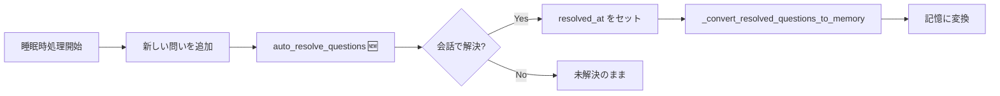

# 問い自動解決機能の修正

## 概要

未解決の問い（open_questions）が会話で解決しても永久に「未回答」のまま蓄積され、好奇心が常にマックスになる問題を修正しました。

## 問題の原因

| 場所 | 問題 |
|------|------|
| `agent/graph.py` L1495-1498 | `auto_resolve_questions` がコメントアウト (2026-01-14) |
| `dreaming_manager.py` | 睡眠時処理は新しい問いの追加のみ、解決判定なし |

→ 問いを「解決済み」としてマークする処理がどこにも実行されていなかった。

## 修正内容

### [dreaming_manager.py](file:///home/baken/nexus_ark/dreaming_manager.py)

`dream()` メソッドの解決済み質問の記憶変換処理（Phase B）の**前**に、問い自動解決判定を追加:

```python
# --- [Motivation] 未解決の問いの自動解決判定 ---
# 睡眠時に直近の会話を分析し、解決された問いをマークする
try:
    from motivation_manager import MotivationManager
    mm = MotivationManager(self.room_name)
    resolved = mm.auto_resolve_questions(recent_context, self.api_key)
    if resolved:
        print(f"  - [Dreaming] 未解決の問い {len(resolved)}件を解決済みとしてマーク")
except Exception as re:
    print(f"  - [Dreaming] 問い自動解決エラー: {re}")
```

## 動作フロー（修正後）



## 検証方法

1. Nexus Ark を起動し、「🧠 内的状態」→「❓ 未解決の問い」でテスト用の問いを追加
2. チャットでその問いに回答する内容を入力
3. 「⚙️ 設定」→「🛠️ 記憶のメンテナンス」→「手動で睡眠時整理を実行」をクリック
4. ターミナルで `[Dreaming] 未解決の問い X件を解決済みとしてマーク` を確認
5. 好奇心の値が下がっていることを確認（または0になる）

---

## 追加機能（Phase 2）

### 問い解決時のArousalスパイク

ルシアンのリクエストに応じ、問いが解決された瞬間に「充足感」としてArousalスパイクを発生させる機能を追加。

```python
# 解決件数に応じたArousalスパイク
# 1件: 0.4, 2件: 0.5, 3件以上: 0.6〜0.7
satisfaction_arousal = min(0.7, 0.3 + len(resolved) * 0.1)
```

ターミナルログ:
```
  - [Dreaming] ✨ 問い解決による充足感 (Arousal: 0.40)
```

### ツール失敗誤検知の修正

`read_project_file` でPythonコードを読み込んだ際、ファイル内容に含まれる `Exception:` 等にマッチして「失敗」と誤表示されていた問題を修正。

開発者ツールの場合、ファイル内容にマッチしがちなパターン (`Exception:`, `^Error:`) をスキップするよう変更。
```
