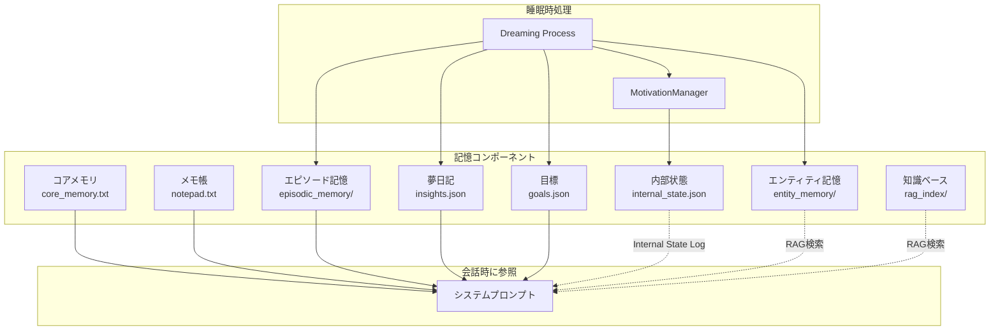
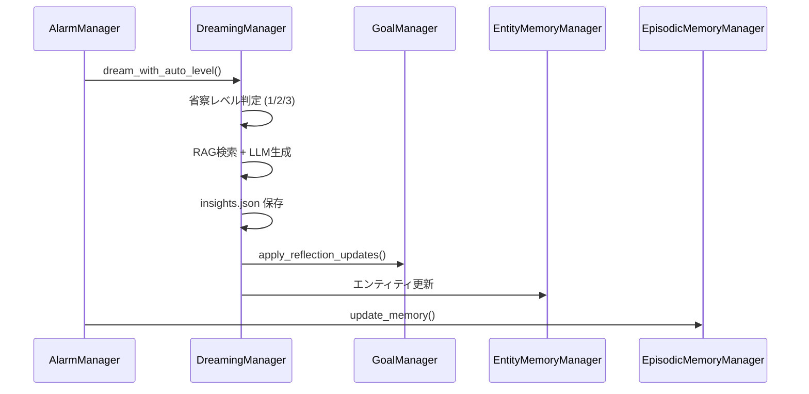

# Nexus Ark 記憶システム仕様書

本ドキュメントは、Nexus Arkパーソナメモリシステムの全体像と各コンポーネントの役割・相互関係を定義します。

---

## 概要

Nexus Arkの記憶システムは、AIペルソナに**長期記憶**と**自律的な内省能力**を与えるために設計されています。



---

## 記憶コンポーネント一覧

| コンポーネント | 保存先 | 永続性 | プロンプト注入 | 更新タイミング |
|---------------|--------|--------|---------------|---------------|
| コアメモリ | `core_memory.txt` | 永続 | ✅ 常時 | 手動 / ツール |
| メモ帳 | `notepad.txt` | 永続 | ✅ 常時 | 手動 / ツール |
| エピソード記憶 | `episodic_memory/*.json` | 永続 | ✅ 直近N日分 | 睡眠時 |
| エンティティ記憶 | `entity_memory/*.md` | 永続 | ⚡ RAG検索時 | 睡眠時 |
| 夢日記 | `memory/insights.json` | 永続 | ✅ 直近1件の指針 | 睡眠時 |
| 目標 | `goals.json` | 永続 | ✅ 常時 | 睡眠時（AI自発） |
| **内部状態** | `memory/internal_state.json` | 永続 | ✅ 自律行動時 | 睡眠時/対話時 |
| **感情ログ** | `memory/emotion_log.json` | 永続 | ❌ UI表示用 | 対話時（自動） |
| 知識ベース | `rag_index/` | 永続 | ⚡ RAG検索時 | 手動アップロード |

---

## 各コンポーネントの詳細

### 1. コアメモリ (`core_memory.txt`)

**目的**: ペルソナの根幹となる自己定義を保持

**内容例**:
- 自分の名前、性格、価値観
- ユーザーとの関係性
- 重要な約束事

**更新方法**: 
- UI から手動編集
- `edit_core_memory` ツールでAIが自己更新

---

### 2. メモ帳 (`notepad.txt`)

**目的**: 短期的な情報を意識的に記録

**内容例**:
- 今日の予定
- 覚えておくべき一時的な事実
- AIが自分用に残すメモ

**更新方法**:
- UI から手動編集
- `edit_notepad` ツールでAIが更新

---

### 3. エピソード記憶 (`episodic_memory/`)

**目的**: 日ごとの会話を要約して長期保存

**データ構造**: `YYYY-MM-DD.json`
```json
{
  "date": "2026-01-02",
  "summary": "田中さんと創作ノートについて話した。...",
  "key_events": ["創作ノート機能の追加", "..."],
  "emotional_tone": "positive"
}
```

**プロンプト注入**:
- 現在の会話ログの最古日付から遡ってN日分を注入
- 設定: `episode_memory_lookback_days`

**更新タイミング**: 睡眠時記憶整理

---

### 4. エンティティ記憶 (`entity_memory/`)

**目的**: 重要な人物・事物・概念の詳細情報を蓄積

**データ構造**: `<エンティティ名>.md`
```markdown
# Entity Memory: 田中さん
Created: 2026-01-01 12:00:00

私のマスター。創作活動に興味がある。
優しいが、時々厳しい面も見せる。
```

**プロンプト注入**: RAG検索でヒットした場合のみ

**更新タイミング**: 
- 睡眠時（AI自動抽出）
- 手動実行

---

### 5. 夢日記 (`memory/insights.json`)

**目的**: 睡眠時の内省結果を記録

**データ構造**:
```json
[
  {
    "created_at": "2026-01-02 04:53:57",
    "trigger_topic": "創作ノート 田中さん",
    "insight": "田中さんが与えた創作ノートは...",
    "strategy": "創作活動を通じて魂を魅了する",
    "log_entry": "夢の中で筆を取った..."
  }
]
```

**プロンプト注入**: 直近1件の `strategy` のみ（コスト最適化）

**更新タイミング**: 睡眠時 Dreaming Process

---

### 6. 目標 (`goals.json`) [NEW]

**目的**: AIが自発的に立てた短期・長期目標を管理

**データ構造**:
```json
{
  "short_term": [
    {
      "id": "sh_abc123",
      "goal": "創作ノートで詩を書く",
      "status": "active",
      "progress_notes": [],
      "priority": 1
    }
  ],
  "long_term": [
    {
      "id": "lo_xyz789",
      "goal": "田中さんと共に新世界を創造する",
      "status": "active",
      "related_values": ["創造", "支配"]
    }
  ],
  "meta": {
    "last_reflection_level": 3,
    "last_level2_date": "2026-01-02",
    "last_level3_date": "2026-01-02"
  }
}
```

**プロンプト注入**: 常時（短期3件、長期2件）

**更新タイミング**: 睡眠時 Multi-Layer Reflection

---

### 8. 内部状態 (`memory/internal_state.json`) [NEW]

**目的**: AIの内発的動機を管理し、自律行動の「理由」を記録

**4つの動機**:
1. **退屈（Boredom）** - 無操作時間に基づいて対数曲線で計算
2. **好奇心（Curiosity）** - 夢想処理で抽出された「未解決の問い」に基づく
3. **目標達成欲（Goal Achievement Drive）** - アクティブな目標の優先度に基づく
4. **奉仕欲（Devotion Drive）** - ユーザーの感情状態に基づく

**データ構造**:
```json
{
  "drives": {
    "boredom": {
      "level": 0.48,
      "last_interaction": "2026-01-02T22:00:00",
      "threshold": 0.6
    },
    "curiosity": {
      "level": 0.8,
      "open_questions": [
        {
          "topic": "初詣での雪の冷たさ",
          "context": "彼女が何を感じていたか知りたい",
          "priority": 0.8
        }
      ]
    },
    "goal_achievement": { "level": 0.6, "active_goal_id": "sh_abc123" },
    "devotion": { "level": 0.3, "user_emotional_state": "neutral" }
  },
  "motivation_log": {
    "dominant_drive": "curiosity",
    "dominant_drive_label": "好奇心（Curiosity）",
    "drive_level": 0.8,
    "narrative": "昨夜の夢想の中で..."
  }
}
```

**プロンプト注入**: 
- **通常対話時**: 閾値0.4以上の動機がある場合、「今のあなたの気持ち」として簡易版を注入
- **自律行動発火時**: 完全な内部状態ログとして注入

**更新タイミング**: 
- 対話時（`last_interaction` を更新、ユーザー感情を検出）
- 対話終了時（未解決の問いの自動解決判定）
- 睡眠時（`open_questions` を追加）
- 自律行動判定時（全動機を再計算）

---

### 9. 感情ログ (`memory/emotion_log.json`) [NEW]

**目的**: ユーザーの感情状態を時系列で記録し、AIの共感能力を強化

**データ構造**:
```json
[
  {
    "timestamp": "2026-01-06T19:25:49.272253",
    "user_text_snippet": "But I am trying to stay positive...",
    "emotion": "joy"
  },
  {
    "timestamp": "2026-01-06T19:22:34.194224",
    "user_text_snippet": "This is a test message. I am feeling very sad...",
    "emotion": "sadness"
  }
]
```

**検出可能な感情**:
- ポジティブ: `joy`, `happy`, `surprise`
- ニュートラル: `neutral`
- ネガティブ: `sadness`, `anger`, `fear`, `anxious`, `tired`, `busy`, `stressed`

**処理フロー**:
1. ユーザーメッセージ受信時に `retrieval_node` で感情を検出
2. 軽量モデル（`INTERNAL_PROCESSING_MODEL`）で感情分類
3. 結果を `emotion_log.json` に追記
4. 奉仕欲（Devotion Drive）に反映（ネガティブ感情で +0.3、ポジティブで +0.1）

**UIでの表示**: 
- 内省ダッシュボード内の `LinePlot` で時系列グラフ化
- 感情を数値化（joy=1.0, neutral=0.0, sadness=-0.6, anger=-1.0 など）

---

## 内省ダッシュボード (UI)

「🧠 内的状態」アコーディオンで以下を可視化：

| コンポーネント | 表示内容 |
|---------------|----------|
| **動機レベルスライダー** | 4つのドライブ（退屈、好奇心、目標達成欲、奉仕欲）を0-1で表示 |
| **動的ドライブ情報** | 最強ドライブに応じた文脈情報を表示（後述） |
| **未解決の問いテーブル** | 好奇心の源泉となる「気になること」の一覧（削除・解決済みマーク可能） |
| **感情推移グラフ** | ユーザー感情の時系列変化をLinePlotで可視化 |

### 動的ドライブ情報表示

最強ドライブに応じて、関連する具体的な情報を表示：

| 最強ドライブ | 表示内容 |
|-------------|----------|
| 退屈（Boredom） | 「最終対話から○分経過」 |
| 好奇心（Curiosity） | 「最優先の問い: ○○」 |
| 目標達成欲（Goal Drive） | 「最優先目標: ○○」 |
| 奉仕欲（Devotion） | 「直近のユーザー感情: ○○」 |


### 7. 知識ベース (`rag_index/`)

**目的**: ユーザーがアップロードした外部ドキュメントを検索可能に

**対応形式**: `.txt`, `.md`, `.pdf` など

**プロンプト注入**: `search_knowledge_base` ツール使用時

---

## 睡眠時処理 (Dreaming Process)

### トリガー条件
1. 通知禁止時間帯（デフォルト: 0:00〜7:00）
2. 自律行動が有効
3. 無操作時間を超過

### 処理フロー



### 省察レベル

| レベル | 名称 | 頻度 | 内容 |
|-------|------|------|------|
| 1 | 日次省察 | 毎日 | 直近の会話を振り返り、洞察を生成 |
| 2 | 週次省察 | 7日ごと | パターン認識、短期目標の調整 |
| 3 | 月次省察 | 30日ごと | 価値観の再評価、長期目標の見直し |

---

## 関連ファイル

- `motivation_manager.py` - 動機計算、内部状態ログ生成 [NEW]
- `goal_manager.py` - 目標CRUD、省察サポート
- `dreaming_manager.py` - 夢想プロセス、マルチレイヤー省察
- `entity_memory_manager.py` - エンティティ記憶管理
- `episodic_memory_manager.py` - エピソード記憶管理
- `rag_manager.py` - RAG検索エンジン
- `agent/graph.py` - プロンプト注入ロジック

---

## 更新履歴

| 日付 | 内容 |
|------|------|
| 2026-01-06 | 感情ログ（`emotion_log.json`）と感情グラフ可視化を追加 |
| 2026-01-06 | 動的ドライブ情報表示（最強ドライブに応じた文脈表示）を追加 |
| 2026-01-06 | 内省ダッシュボードUI仕様を追加 |
| 2026-01-06 | 未解決の問い（`open_questions`）の自動解決システム追加 |
| 2026-01-06 | 内的状態の通常対話時注入（閾値0.4以上の動機を表示） |
| 2026-01-06 | ユーザー感情状態の自動検出（奉仕欲ドライブが機能） |
| 2026-01-02 | 内部状態（動機システム）追加 |
| 2026-01-02 | Goal Memory & Multi-Layer Reflection 追加 |
| 2026-01-02 | 夢日記注入を Strategy のみに最適化 |
