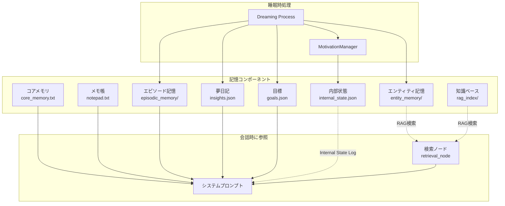
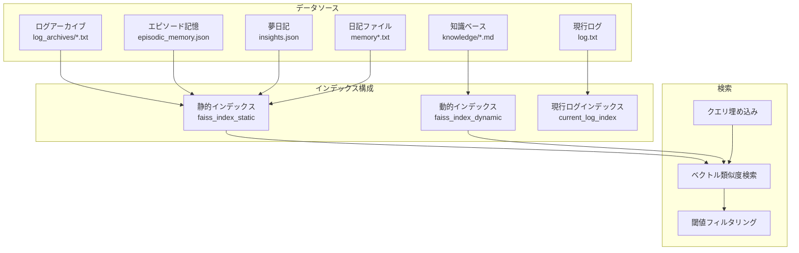
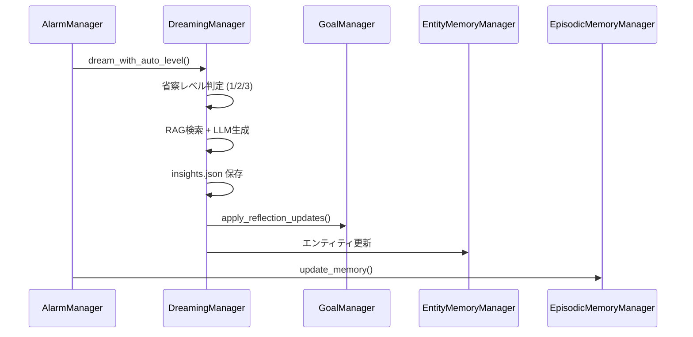

# Nexus Ark 記憶システム仕様書

本ドキュメントは、Nexus Arkパーソナメモリシステムの全体像と各コンポーネントの役割・相互関係を定義します。

---

## 概要

Nexus Arkの記憶システムは、AIペルソナに**長期記憶**と**自律的な内省能力**を与えるために設計されています。



---

## 記憶コンポーネント一覧

| コンポーネント | 保存先 | 永続性 | プロンプト注入 | 更新タイミング |
|---------------|--------|--------|---------------|---------------|
| コアメモリ | `core_memory.txt` | 永続 | ✅ 常時 | 手動 / ツール |
| メモ帳 | `notepad.txt` | 永続 | ✅ 常時 | 手動 / ツール |
| エピソード記憶 | `episodic_memory/*.json` | 永続 | ✅ 直近N日分 | 睡眠時 |
| エンティティ記憶 | `entity_memory/*.md` | 永続 | ⚡ RAG検索時 | 睡眠時 |
| 夢日記 | `memory/insights.json` | 永続 | ✅ 直近1件の指針 | 睡眠時 |
| 目標 | `goals.json` | 永続 | ✅ 常時 | 睡眠時（AI自発） |
| **内部状態** | `memory/internal_state.json` | 永続 | ✅ 自律行動時 | 睡眠時/対話時 |
| **感情ログ** | `memory/emotion_log.json` | 永続 | ❌ UI表示用 | 対話時（自動） |
| 知識ベース | `rag_index/` | 永続 | ⚡ RAG検索時 | 手動アップロード |

---

## 各コンポーネントの詳細

### 1. コアメモリ (`core_memory.txt`)

**目的**: ペルソナの根幹となる自己定義を保持

**内容例**:
- 自分の名前、性格、価値観
- ユーザーとの関係性
- 重要な約束事

**更新方法**: 
- UI から手動編集
- `edit_core_memory` ツールでAIが自己更新

---

### 2. メモ帳 (`notepad.txt`)

**目的**: 短期的な情報を意識的に記録

**内容例**:
- 今日の予定
- 覚えておくべき一時的な事実
- AIが自分用に残すメモ

**更新方法**:
- UI から手動編集
- `edit_notepad` ツールでAIが更新

---

### 3. エピソード記憶 (`episodic_memory/`)

**目的**: 日ごとの会話を要約して長期保存

**データ構造**: `YYYY-MM-DD.json`
```json
{
  "date": "2026-01-02",
  "summary": "田中さんと創作ノートについて話した。...",
  "key_events": ["創作ノート機能の追加", "..."],
  "emotional_tone": "positive"
}
```

**プロンプト注入**:
- 現在の会話ログの最古日付から遡ってN日分を注入
- 設定: `episode_memory_lookback_days` (デフォルト14日)
- `oldest_log_date_str` (生ログの最古日付) 以前の記憶を、指定日数分だけ遡って要約注入


**更新タイミング**: 睡眠時記憶整理

---

### 4. エンティティ記憶 (`entity_memory/`)

**目的**: 重要な人物・事物・概念の詳細情報を蓄積

**データ構造**: `<エンティティ名>.md`
```markdown
# Entity Memory: 田中さん
Created: 2026-01-01 12:00:00

私のマスター。創作活動に興味がある。
優しいが、時々厳しい面も見せる。
```

**プロンプト注入**: RAG検索でヒットした場合のみ

**更新タイミング**: 
- 睡眠時（AI自動抽出）
- 手動実行

---

### 5. 夢日記 (`memory/insights.json`)

**目的**: 睡眠時の内省結果を記録

**データ構造**:
```json
[
  {
    "created_at": "2026-01-02 04:53:57",
    "trigger_topic": "創作ノート 田中さん",
    "insight": "田中さんが与えた創作ノートは...",
    "strategy": "創作活動を通じて魂を魅了する",
    "log_entry": "夢の中で筆を取った..."
  }
]
```

**プロンプト注入**: 直近1件の `strategy` のみ（コスト最適化）

**更新タイミング**: 睡眠時 Dreaming Process

---

### 6. 目標 (`goals.json`) [NEW]

**目的**: AIが自発的に立てた短期・長期目標を管理

**データ構造**:
```json
{
  "short_term": [
    {
      "id": "sh_abc123",
      "goal": "創作ノートで詩を書く",
      "status": "active",
      "progress_notes": [],
      "priority": 1
    }
  ],
  "long_term": [
    {
      "id": "lo_xyz789",
      "goal": "田中さんと共に新世界を創造する",
      "status": "active",
      "related_values": ["創造", "支配"]
    }
  ],
  "meta": {
    "last_reflection_level": 3,
    "last_level2_date": "2026-01-02",
    "last_level3_date": "2026-01-02"
  }
}
```

**プロンプト注入**: 常時（短期3件、長期2件）

**更新タイミング**: 睡眠時 Multi-Layer Reflection

---

### 8. 内部状態 (`memory/internal_state.json`) [NEW]

**目的**: AIの内発的動機を管理し、自律行動の「理由」を記録

**4つの動機**:
1. **退屈（Boredom）** - 無操作時間に基づいて対数曲線で計算
2. **好奇心（Curiosity）** - 夢想処理で抽出された「未解決の問い」に基づく
3. **目標達成欲（Goal Achievement Drive）** - アクティブな目標の優先度に基づく
4. **奉仕欲（Devotion Drive）** - ユーザーの感情状態に基づく

**データ構造**:
```json
{
  "drives": {
    "boredom": {
      "level": 0.48,
      "last_interaction": "2026-01-02T22:00:00",
      "threshold": 0.6
    },
    "curiosity": {
      "level": 0.8,
      "open_questions": [
        {
          "topic": "初詣での雪の冷たさ",
          "context": "彼女が何を感じていたか知りたい",
          "priority": 0.8
        }
      ]
    },
    "goal_achievement": { "level": 0.6, "active_goal_id": "sh_abc123" },
    "devotion": { "level": 0.3, "user_emotional_state": "neutral" }
  },
  "motivation_log": {
    "dominant_drive": "curiosity",
    "dominant_drive_label": "好奇心（Curiosity）",
    "drive_level": 0.8,
    "narrative": "昨夜の夢想の中で..."
  }
}
```

**プロンプト注入**: 
- **通常対話時**: 閾値0.4以上の動機がある場合、「今のあなたの気持ち」として簡易版を注入
- **自律行動発火時**: 完全な内部状態ログとして注入

**更新タイミング**: 
- 対話時（`last_interaction` を更新、ユーザー感情を検出）
- 対話終了時（未解決の問いの自動解決判定）
- 睡眠時（`open_questions` を追加）
- 自律行動判定時（全動機を再計算）

---

### 9. 感情ログ (`memory/emotion_log.json`) [NEW]

**目的**: ユーザーの感情状態を時系列で記録し、AIの共感能力を強化

**データ構造**:
```json
[
  {
    "timestamp": "2026-01-06T19:25:49.272253",
    "user_text_snippet": "But I am trying to stay positive...",
    "emotion": "joy"
  },
  {
    "timestamp": "2026-01-06T19:22:34.194224",
    "user_text_snippet": "This is a test message. I am feeling very sad...",
    "emotion": "sadness"
  }
]
```

**検出可能な感情**:
- ポジティブ: `joy`, `happy`, `surprise`
- ニュートラル: `neutral`
- ネガティブ: `sadness`, `anger`, `fear`, `anxious`, `tired`, `busy`, `stressed`

**処理フロー**:
1. ユーザーメッセージ受信時に `retrieval_node` で感情を検出
2. 軽量モデル（`INTERNAL_PROCESSING_MODEL`）で感情分類
3. 結果を `emotion_log.json` に追記
4. 奉仕欲（Devotion Drive）に反映（ネガティブ感情で +0.3、ポジティブで +0.1）

**UIでの表示**: 
- 内省ダッシュボード内の `LinePlot` で時系列グラフ化
- 感情を数値化（joy=1.0, neutral=0.0, sadness=-0.6, anger=-1.0 など）

---

## 内省ダッシュボード (UI)

「🧠 内的状態」アコーディオンで以下を可視化：

| コンポーネント | 表示内容 |
|---------------|----------|
| **動機レベルスライダー** | 4つのドライブ（退屈、好奇心、目標達成欲、奉仕欲）を0-1で表示 |
| **動的ドライブ情報** | 最強ドライブに応じた文脈情報を表示（後述） |
| **未解決の問いテーブル** | 好奇心の源泉となる「気になること」の一覧（削除・解決済みマーク可能） |
| **感情推移グラフ** | ユーザー感情の時系列変化をLinePlotで可視化 |

### 動的ドライブ情報表示

最強ドライブに応じて、関連する具体的な情報を表示：

| 最強ドライブ | 表示内容 |
|-------------|----------|
| 退屈（Boredom） | 「最終対話から○分経過」 |
| 好奇心（Curiosity） | 「最優先の問い: ○○」 |
| 目標達成欲（Goal Drive） | 「最優先目標: ○○」 |
| 奉仕欲（Devotion） | 「直近のユーザー感情: ○○」 |


### 7. 知識ベース (`rag_index/`)

**目的**: ユーザーがアップロードした外部ドキュメントを検索可能に

**対応形式**: `.txt`, `.md`, `.pdf` など

**プロンプト注入**: 
- `search_knowledge_base` ツール使用時
- 会話ごとの自動検索（retrieval_node）でヒット時


---

## 能動的記憶想起 (Active Memory Recall)

Nexus Arkは、ユーザーの発言に対して受動的に応答するだけでなく、必要に応じて**能動的に記憶を検索**し、コンテキストを補完します。

### 処理フロー (`retrieval_node`)

1. **検索要否の判断**:
   - 軽量LLM (`INTERNAL_PROCESSING_MODEL`) が、ユーザーの直前の発言を分析。
   - 過去の情報の参照が必要かを判断し、「検索クエリ」を生成。
   - ※ 設定 `enable_auto_retrieval` でON/OFF可能。

2. **検索対象** (2025-01-07 リデザイン):
   以下のソースをRAG検索し、結果をコンテキストに注入します。

   - **日記 (Diary)**: AI自身の過去の経験、感情の記録（`memory_main.txt`, `memory_archived_*.txt`）
   - **エンティティ記憶 (Entity Memory)**: 特定の人物・事物に関する詳細プロファイル

   > [!IMPORTANT]
   > **知識ベースは自動検索対象から除外されました。**
   > 知識ベースは「外部資料・マニュアル」用であり、会話コンテキストへの自動注入は不適切と判断したため。
   > AIが資料を調べたい場合は `search_knowledge_base` ツールを能動的に使用します。

3. **コンテキスト注入**:
   検索結果は `retrieval_node` の出力としてシステムプロンプトに動的に挿入され、続く応答生成で使用されます。

---

## RAG検索システム (RAG System)

`rag_manager.py` が管理する、長期記憶と外部知識の検索基盤です。

### アーキテクチャ

ハイブリッドなインデックス管理により、更新頻度の異なるデータを効率的に扱います。



#### 1. 静的インデックス (`faiss_index_static`)
- **対象**: 
  - 過去ログアーカイブ (`log_archives/*.txt`)
  - エピソード記憶 (`episodic_memory.json`)
  - 夢日記 (`insights.json`)
  - 日記ファイル (`memory/memory*.txt`, `memory/memory_archived_*.txt`)
- **特徴**: 更新頻度が低い、または追記型データ。
- **更新**: `update_memory_index()` で差分のみを定期的にベクトル化。
- **差分検出**: `processed_static_files.json` でインデックス済みファイルを記録し、重複処理を回避。

#### 2. 動的インデックス (`faiss_index_dynamic`)
- **対象**: 
  - 知識ベース (`knowledge/*.md`, `*.txt`)
- **特徴**: ユーザーによる追加・編集が発生するデータ。
- **更新**: `update_knowledge_index()` でフォルダ内を全再構築。

#### 3. 現行ログインデックス (`current_log_index`)
- **対象**: 
  - 現在進行中のログ (`log.txt`)
- **特徴**: 頻繁に更新される。
- **更新**: 必要なタイミングでオンデマンドに近い形で更新。

---

### 検索アルゴリズム

#### ベクトル検索 (Vector Search)
- **ライブラリ**: FAISS (Facebook AI Similarity Search)
- **距離関数**: L2距離（ユークリッド距離）
- **特徴**: 意味的な類似性に基づく柔軟な検索が可能

#### 検索フロー
1. クエリをエンベディングモデルでベクトル化
2. 静的・動的インデックスそれぞれで類似度検索を実行
3. 結果を統合し、スコアでソート（昇順：低いほど類似）
4. 閾値でフィルタリングし、関連性の高い結果のみ返却

```python
# 検索の流れ（rag_manager.py より抜粋）
results_with_scores = []
dynamic_results = dynamic_db.similarity_search_with_score(query, k=k)
static_results = static_db.similarity_search_with_score(query, k=k)
# 統合してスコアでソート
results_with_scores.sort(key=lambda x: x[1])
# 閾値でフィルタ
filtered_docs = [doc for doc, score in results_with_scores if score <= score_threshold]
```

> [!NOTE]
> **ハイブリッド検索（BM25等）は現時点では未実装**
> キーワード検索とベクトル検索を組み合わせたハイブリッド検索は、将来の改善候補として検討中です。
> 現在は `search_past_conversations` ツールでキーワード検索を補完しています。

#### 検索結果の件数とソート順

##### RAG検索 (`recall_memories`, `rag_manager.search`)

| パラメータ | 値 | 説明 |
|-----------|-----|------|
| **インデックスあたり取得数** | 10件 | 静的/動的インデックスそれぞれから最大10件取得 |
| **閾値フィルタ後の最大件数** | 10件 | スコア閾値を通過した結果から最大10件 |
| **AIへの最終提示数** | 7件 | `recall_memories`ではトリミングして最大7件を提示 |
| **ソート順** | 類似度順（高い順） | L2距離スコアが低い（＝類似度が高い）順 |

**選択ロジック:**
1. 静的インデックスから最大10件、動的インデックスから最大10件を取得
2. 両者を統合（最大20件）
3. L2距離スコアで昇順ソート（類似度の高い順）
4. 閾値（0.75〜0.80）以下の結果のみフィルタ
5. 最大10件を返却
6. `recall_memories`ツールでは最終的に7件にトリミングしてAIに提示

> [!TIP]
> **新しい/古いの区別はない**
> RAG検索では日付によるソートは行わず、純粋に意味的類似度でランキングします。
> この設計により、「昔言っていたこと」も「最近の話」も、クエリとの関連性が高ければ均等に想起されます。

##### キーワード検索 (`search_past_conversations`)

| パラメータ | 値 | 説明 |
|-----------|-----|------|
| **最大取得件数** | 4件 | 新しい方2件 + 古い方2件 |
| **選択方式** | 時間帯別枠取り | 新旧両方からサンプリング |
| **検索対象** | 全ログファイル | `log.txt`, `log_archives/*.txt`, `log_import_source/*.txt` |

**選択ロジック (2026-01-07改善):**
1. 指定キーワードを含む発言ブロック（ヘッダー〜次のヘッダーまで）を抽出
2. 各ブロックから日付を抽出（タイムスタンプ or 日付ヘッダー）
3. 日付の新しい順にソート
4. **時間帯別枠取り:**
   - 新しい方から2件
   - 古い方から2件（重複除外）
5. 合計最大4件を返却

**最近のログ除外機能:**
- 設定 `last_api_history_limit_option` に基づき、直近N件のメッセージを検索対象から除外
- これにより「今話している内容」がノイズとして混入することを防止

---

### 精度向上のための手法

現在のRAGシステムでは、以下の手法で検索精度を向上させています。

#### 1. チャンク分割戦略 (Chunking Strategy)

```python
text_splitter = RecursiveCharacterTextSplitter(
    chunk_size=300,      # 1チャンクあたり300文字
    chunk_overlap=50     # 隣接チャンク間で50文字重複
)
```

| パラメータ | 値 | 説明 |
|-----------|-----|------|
| `chunk_size` | 300 | 小さめのチャンクで文脈の粒度を高く保つ |
| `chunk_overlap` | 50 | 文脈の断絶を防ぐための重複領域 |

> [!TIP]
> **チャンクサイズの選択理由**
> - 日本語の場合、300文字は自然な段落サイズに近い
> - 小さなチャンクは精度を上げるが、検索結果が断片的になりやすい
> - 50文字のオーバーラップで、文境界での情報欠落を軽減

#### 2. 類似度スコア閾値 (Similarity Threshold)

| 用途 | 閾値 | 説明 |
|------|------|------|
| 記憶検索 (`recall_memories`) | 0.80 | やや厳格。関連性の高い結果のみ |
| 一般RAG検索 | 0.75 | 標準的な閾値 |
| 自動記憶想起 (`retrieval_node`) | 0.75 | 自動注入時の品質担保 |

> [!IMPORTANT]
> **スコアの解釈 (L2距離の場合)**
> - スコアが **低いほど** 類似度が **高い**
> - 0.0 = 完全一致
> - 1.0 = かなり異なる
> - 2.0以上 = ほぼ無関係

#### 3. エンベディングモデル

| モード | モデル | 特徴 |
|--------|--------|------|
| API (デフォルト) | `models/text-embedding-004` | 高品質、APIコスト発生 |
| ローカル | `sentence-transformers/paraphrase-multilingual-MiniLM-L12-v2` | 無料、オフライン対応 |

**タスクタイプ指定** (APIモード):
```python
task_type="retrieval_document"  # ドキュメント検索に最適化
```

#### 4. 増分インデックス更新 (Incremental Indexing)

- **差分検出**: `processed_static_files.json` でインデックス済みファイル/エピソードを記録
- **チェックポイント保存**: 5アイテムごとにインデックスを保存し、中断時のデータロスを最小化
- **ハッシュベース変更検出**: 日記ファイルは内容のMD5ハッシュで変更を検出

```python
# 日記ファイルの変更検出例
content_hash = hashlib.md5(content.encode()).hexdigest()[:8]
record_id = f"diary:{filename}:{content_hash}"
```

#### 5. メタデータによるソース識別

すべてのドキュメントにメタデータを付与し、検索結果のフィルタリングと表示を改善:

| type | 説明 |
|------|------|
| `log_archive` | 過去の会話ログアーカイブ |
| `episodic_memory` | エピソード記憶（日次要約） |
| `dream_insight` | 夢日記・深層心理の記録 |
| `diary` | 主観的日記（memory*.txt） |
| `knowledge` | 知識ベースドキュメント |
| `current_log` | 現行ログ |

#### 6. APIレート制限対策

```python
BATCH_SIZE = 20  # 一度にベクトル化するドキュメント数
time.sleep(2)    # バッチ間の待機時間（APIモード時）
```

リトライロジック:
- 429エラー検知時は指数バックオフで再試行
- 最大3回リトライ、失敗時はバッチをスキップ

---

### 検索結果の品質管理

#### UI表示での生データ除外 (2026-01-07)

記憶検索ツール（`recall_memories`, `search_past_conversations`）の結果は：
- **チャットログに保存されるのはアナウンスのみ**（例：「🛠️ 過去の会話を検索しました」）
- **生の検索結果（会話ログ本文）はログに保存されない**
- 検索結果はAIのコンテキストとしてのみ使用され、ユーザーには表示されない

これにより以下を実現:
- コンテキストウィンドウの圧迫防止
- APIコストの削減
- チャット履歴の可読性維持

---

## 記憶関連ツール (Memory Tools)

AIペルソナが自律的に記憶を操作するために、以下のツールが定義されています。

### 検索ツール

| ツール名 | 検索方式 | 検索対象 | 用途 |
|---------|---------|---------|------|
| `recall_memories` | RAG（意味検索） | 日記、過去ログアーカイブ、エピソード記憶、夢の記録 | 過去の体験・会話・思い出を思い出す |
| `search_knowledge_base` | RAG（意味検索） | 知識ベース（`knowledge/`フォルダ内のドキュメント） | 外部資料・マニュアル・設定資料を調べる |
| `search_past_conversations` | キーワード完全一致 | 会話ログ（`log.txt`, `log_archives/`, `log_import_source/`） | 特定フレーズの引用探し（最終手段） |
| `search_entity_memory` | キーワードマッチ | エンティティ記憶（`entity_memory/`） | 特定の人物・事物に関する記憶を検索 |

> [!TIP]
> **ツール選択の判断基準**
> 1. 過去の体験・会話・日記を思い出したい → `recall_memories`
> 2. 外部資料・マニュアルを調べたい → `search_knowledge_base`
> 3. 特定のキーワードが含まれる発言を探したい → `search_past_conversations`

### 読み取り・編集ツール

| ツール名 | 説明 |
|---------|------|
| `read_main_memory` | 現在の主観的記憶（`memory_main.txt`）の全文を読む |
| `plan_main_memory_edit` | 主観的記憶の編集・追記を計画する |
| `read_secret_diary` | 秘密の日記を読む |
| `plan_secret_diary_edit` | 秘密の日記の編集を計画する |
| `read_entity_memory` | 特定のエンティティの詳細を読む |
| `write_entity_memory` | エンティティ記憶を更新する |
| `list_entity_memories` | 記憶しているエンティティの一覧を取得する |

> [!WARNING]
> **知識ベースに日記・思い出を入れる運用は非推奨**
> 知識ベースは「外部ドキュメント」用に設計されており、日記と混在すると検索精度が低下します。
> 日記は `memory_main.txt`、詳細情報は `entity_memory` に保存してください。


---

## 睡眠時処理 (Dreaming Process)

### トリガー条件
1. 通知禁止時間帯（デフォルト: 0:00〜7:00）
2. 自律行動が有効
3. 無操作時間を超過

### 処理フロー



### 省察レベル

| レベル | 名称 | 頻度 | 内容 |
|-------|------|------|------|
| 1 | 日次省察 | 毎日 | 直近の会話を振り返り、洞察を生成 |
| 2 | 週次省察 | 7日ごと | パターン認識、短期目標の調整 |
| 3 | 月次省察 | 30日ごと | 価値観の再評価、長期目標の見直し |

---

## 関連ファイル

- `motivation_manager.py` - 動機計算、内部状態ログ生成 [NEW]
- `goal_manager.py` - 目標CRUD、省察サポート
- `dreaming_manager.py` - 夢想プロセス、マルチレイヤー省察
- `entity_memory_manager.py` - エンティティ記憶管理
- `episodic_memory_manager.py` - エピソード記憶管理
- `rag_manager.py` - RAG検索エンジン
- `agent/graph.py` - プロンプト注入ロジック

---

## 更新履歴

| 日付 | 内容 |
|------|------|
| 2026-01-07 | RAG検索システムの詳細仕様を追記: アーキテクチャ図、検索アルゴリズム、精度向上手法（チャンク分割、閾値設定、増分更新、メタデータ管理）を文書化 |
| 2026-01-07 | 記憶検索ツールの結果UI表示仕様を追記: アナウンスのみログ保存、生データ除外 |
| 2026-01-07 | 記憶検索ツールをリデザイン。`recall_memories`を新規追加、`search_past_conversations`を復活、`retrieval_node`から知識ベース検索を除外 |
| 2026-01-06 | 感情ログ（`emotion_log.json`）と感情グラフ可視化を追加 |
| 2026-01-06 | 動的ドライブ情報表示（最強ドライブに応じた文脈表示）を追加 |
| 2026-01-06 | 内省ダッシュボードUI仕様を追加 |
| 2026-01-06 | 未解決の問い（`open_questions`）の自動解決システム追加 |
| 2026-01-06 | 内的状態の通常対話時注入（閾値0.4以上の動機を表示） |
| 2026-01-06 | ユーザー感情状態の自動検出（奉仕欲ドライブが機能） |
| 2026-01-02 | 内部状態（動機システム）追加 |
| 2026-01-02 | Goal Memory & Multi-Layer Reflection 追加 |
| 2026-01-02 | 夢日記注入を Strategy のみに最適化 |
