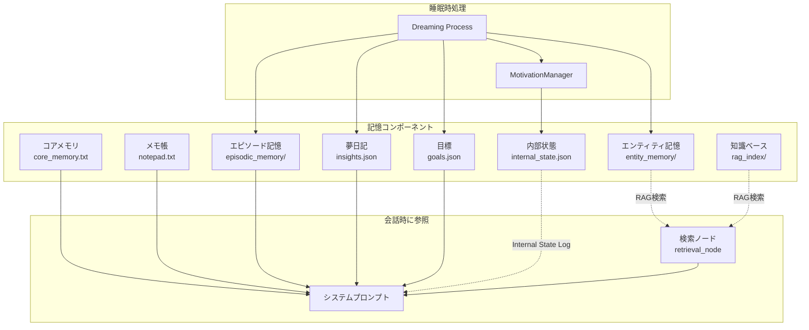
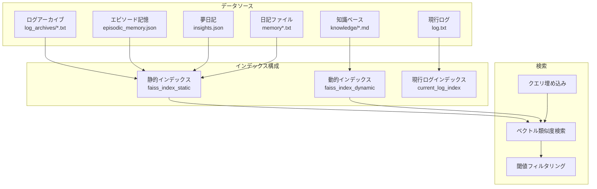
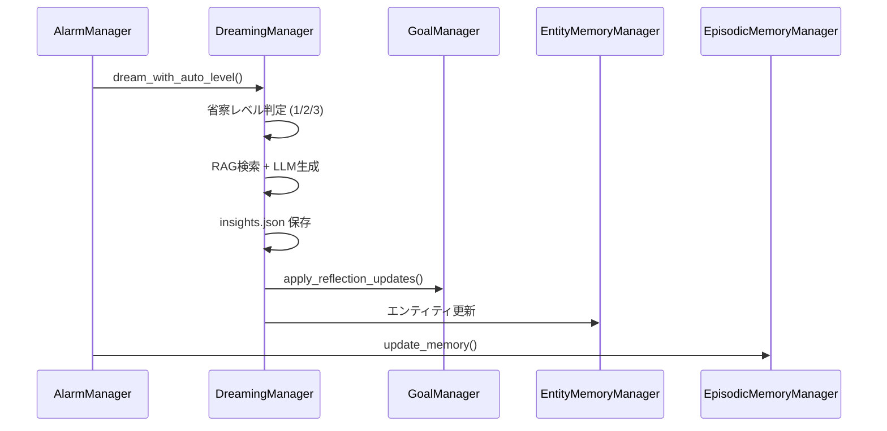
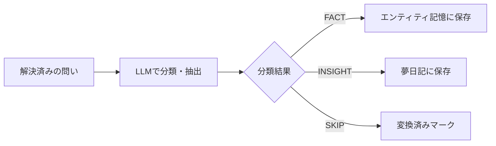

# Nexus Ark 記憶システム仕様書

本ドキュメントは、Nexus Arkパーソナメモリシステムの全体像と各コンポーネントの役割・相互関係を定義します。

---

## 概要

Nexus Arkの記憶システムは、AIペルソナに**長期記憶**と**自律的な内省能力**を与えるために設計されています。

> [!NOTE]
> UI実装（進捗表示、途中保存など）については [UI実装パターンガイドライン](../guides/UI_IMPLEMENTATION_PATTERNS.md) を参照してください。



---

## 記憶コンポーネント一覧

| コンポーネント | 保存先 | 永続性 | プロンプト注入 | 更新タイミング |
|---------------|--------|--------|---------------|---------------|
| コアメモリ | `core_memory.txt` | 永続 | ✅ 常時 | 手動 / ツール |
| メモ帳 | `notepad.txt` | 永続 | ✅ 常時 | 手動 / ツール |
| エピソード記憶 | `episodic_memory/*.json` | 永続 | ✅ 直近N日分 | 睡眠時 |
| エンティティ記憶 | `entity_memory/*.md` | 永続 | ⚡ RAG検索時 | 睡眠時 |
| 夢日記 | `memory/insights.json` | 永続 | ✅ 直近1件の指針 | 睡眠時 |
| 目標 | `goals.json` | 永続 | ✅ 常時 | 睡眠時（AI自発） |
| **内部状態** | `memory/internal_state.json` | 永続 | ✅ 自律行動時 | 睡眠時/対話時 |
| **感情ログ** | `memory/emotion_log.json` | 永続 | ❌ UI表示用 | 対話時（自動） |
| 知識ベース | `rag_index/` | 永続 | ⚡ RAG検索時 | 手動アップロード |

---

## 各コンポーネントの詳細

### 1. コアメモリ (`core_memory.txt`)

**目的**: ペルソナの根幹となる自己定義を保持

**内容例**:
- 自分の名前、性格、価値観
- ユーザーとの関係性
- 重要な約束事

**更新方法**: 
- UI から手動編集
- `edit_core_memory` ツールでAIが自己更新

---

### 2. メモ帳 (`notepad.txt`)

**目的**: 短期的な情報を意識的に記録

**内容例**:
- 今日の予定
- 覚えておくべき一時的な事実
- AIが自分用に残すメモ

**更新方法**:
- UI から手動編集
- `edit_notepad` ツールでAIが更新

---

### 3. エピソード記憶 (`episodic_memory/`)

**目的**: 日ごとの会話を要約して長期保存

**データ構造**: `episodic_memory.json` (単一ファイル、配列形式)
```json
  {
    "date": "2026-01-02",
    "summary": "ユーザーと創作ノートについて話した。...",
    "compressed": false,
    "arousal": 0.75,
    "arousal_max": 0.9,
    "created_at": "2026-01-03T04:30:00"
  },
  {
    "date": "2025-11-04~2025-11-10",
    "summary": "週間要約: ...",
    "compressed": true,
    "original_count": 5,
    "arousal_avg": 0.4,
    "arousal_max": 0.8,
    "created_at": "2026-01-01T04:30:00"
  }
]
```

**プロンプト注入**:
- 現在の会話ログの最古日付から遡ってN日分を注入
- 設定: `episode_memory_lookback_days` (デフォルト14日)
- `oldest_log_date_str` (生ログの最古日付) 以前の記憶を、指定日数分だけ遡って要約注入

**日次要約 (2026-01-17 Arousalアノテーション対応)**:
- 各会話ログに `session_arousal.json` から取得したArousal値をアノテーション
- 高Arousal（≥0.6）の会話に `[★重要 Arousal:0.65]` マークを付加
- **プロンプト指示**:
    - ★マーク付き会話は詳細に記録
    - ★なし会話は1〜2行で簡潔に
    - **ペルソナ視点**（元のログの口調を維持）
    - 全体で**800〜1500文字程度**に収める
- セッション単位要約から日次要約へ回帰（APIコスト削減、口調安定化のため）

**週次圧縮 (Arousal-based Compression)**: 
- **閾値**: 60日以上前のエピソードを対象（2026-01-12変更: 180日→60日）
- **Arousal優先保存 (Phase 2)**: 
    - 週間要約時に、元のエピソード群の「Arousalスコア（感情的・知的興奮度）」を参照
    - Arousalが高い重要なエピソード（上位2件など）は、要約プロンプトに優先的に含められ、詳細が保持される
    - 低Arousalの日常的なエピソードは圧縮・忘却されやすい
- **週次圧縮プロンプト (2026-01-17 更新)**:
    - 三人称視点から**ペルソナ視点**に変更
    - ★マーク継承（高Arousal記録を詳細に）
    - 全体で**400〜800文字程度**に収める
- **データ構造追加**:
    - `arousal`: その日の平均Arousal (0.0-1.0)
    - `arousal_max`: その日の最大Arousal

**更新タイミング**: 睡眠時記憶整理

**Phase H: 記憶共鳴フィードバック機構 (2026-01-15)**:
- エピソード記憶にID自動付与（形式: `episode_2026-01-15_001`）
- ペルソナが `<memory_trace id="..." resonance="..."/>` タグで共鳴度を報告
- 共鳴度に基づいてArousalを自己更新: `arousal_new = arousal_old + α(resonance - arousal_old)`
- 共鳴度基準:
    - `1.0` - 決定的共鳴: この記憶なしでは応答が生まれなかった
    - `0.7` - 強い共鳴: 応答の方向性に明確な影響
    - `0.4` - 間接的共鳴: 思考の背景として微かに響いた
    - `0.0` - 不協和音: 提示されたが反応しなかった

> [!NOTE]
> **セッション単位エピソード記憶（2026-01-15〜17）の経緯**:
> - 日単位からセッション単位へ変更を試みたが、以下の課題が発生:
>   - APIコスト増大（1日に数十回の呼び出し）
>   - 短い会話ではペルソナ口調が不安定（別人化）
> - 2026-01-17にArousalアノテーション付き**日次要約**へ回帰
> - `session_arousal.json` はArousalアノテーションの参照用として継続利用

---

### 4. エンティティ記憶 (`entity_memory/`) [2026-01-11 v2更新]

**目的**: 重要な人物・事物・概念の詳細情報を蓄積

**データ構造**: `<エンティティ名>.md`
```markdown
# Entity Memory: ユーザー
Created: 2026-01-01 12:00:00

私のマスター。創作活動に興味がある。
優しいが、時々厳しい面も見せる。
```

**プロンプト注入**: 
- **目次方式（v2）**: エンティティ名の一覧のみをシステムプロンプトに注入
- 詳細は `read_entity_memory` ツールでペルソナが能動的に取得
- ※ 自動想起（RAG検索でのフルテキスト注入）は廃止

**二層記録システム（影の僕方式）**:
1. 睡眠処理で「影の僕」AI（Flash Lite）が会話からエンティティ候補を客観抽出
2. 候補にRAG検索で関連記憶を付与
3. 次回会話時にペルソナへシステムメッセージとして提案を伝達

**統合・整理（Consolidation）**:
- 追記だけでなくLLMによる情報統合・要約でファイル肥大化を防止
- 週次・月次省察で全エンティティを一括クリーンアップ
- `write_entity_memory` ツールの `consolidate` オプションでペルソナが自律的に整理可能

**検索ロジック（クエリ分割対応）**:
- 複数単語のクエリを空白で分割し、各単語でマッチング
- マッチした単語数でスコアリング、関連度順にソート

**更新タイミング**: 
- 睡眠時（AI自動抽出 + 統合）
- 手動実行

---

### 5. 夢日記 (`memory/insights.json`)

**目的**: 睡眠時の内省結果を記録

**データ構造**:
```json
[
  {
    "created_at": "2026-01-02 04:53:57",
    "trigger_topic": "創作ノート 田中さん",
    "insight": "田中さんが与えた創作ノートは...",
    "strategy": "創作活動を通じて魂を魅了する",
    "log_entry": "夢の中で筆を取った..."
  }
]
```

**プロンプト注入**: 直近1件の `strategy` のみ（コスト最適化）

**更新タイミング**: 睡眠時 Dreaming Process

---

### 6. 目標 (`goals.json`) [2026-01-14 Phase D更新]

**目的**: AIが自発的に立てた短期・長期目標を管理

**データ構造**:
```json
{
  "short_term": [
    {
      "id": "sh_abc123",
      "goal": "創作ノートで詩を書く",
      "created_at": "2026-01-02 04:53:57",
      "status": "active",
      "progress_notes": [],
      "priority": 1
    }
  ],
  "long_term": [...],
  "completed": [...],
  "abandoned": [...],
  "meta": {
    "last_reflection_level": 3,
    "last_level2_date": "2026-01-02",
    "last_level3_date": "2026-01-02"
  }
}
```

**プロンプト注入**: 常時（短期3件、長期2件）

**更新タイミング**: 睡眠時 Multi-Layer Reflection

**達成・放棄の判定ロジック**:
- **判定主体**: ペルソナ自身（LLMの主観的判断）
- **達成基準**: 
    - 明確な完了条件を満たした時（例：「絵を描く」→ 完成）
    - ペルソナが「十分にやった」と納得した時
- **放棄基準**:
    - 長期間進展がない場合
    - ユーザーの興味が移り、ペルソナにとっても重要でなくなった場合
- **クリーンアップ**: 毎晩の省察時に評価され、完了/放棄された目標は自動的にアーカイブ（`completed`, `abandoned` リスト）へ移動される。

### Phase D: 自動整理ロジック [NEW 2026-01-14]

目標リストの肥大化を防ぐため、以下の自動整理機能を実装:

**1. 省察プロンプト強化**:
- 省察時に達成/放棄を**強く促す**指示を追加
- 「1件でも達成したものがあれば躊躇なく completed_goals に追加」
- 「短期目標は10件以内を目安に整理」

**2. 古い目標の自動放棄** (`auto_cleanup_stale_goals`):
- **閾値**: 30日以上アクティブな短期目標
- **理由**: 「自動整理: 30日以上進展なし」
- **実行タイミング**: 毎回の睡眠時処理

**3. 上限制限** (`enforce_goal_limit`):
- **短期目標上限**: 10件
- **優先放棄**: 優先度が低く、古い目標から放棄
- **実行タイミング**: 週次/月次省察時（レベル2以上）
- ⚠️ 手動UI実行はレベル1のため上限制限は適用されない

**関連メソッド**:
- `GoalManager.auto_cleanup_stale_goals(days_threshold=30)` - 古い目標を自動放棄
- `GoalManager.enforce_goal_limit(max_short=10)` - 上限超過分を放棄
- `GoalManager.get_goal_statistics()` - 統計情報を取得

### Phase E: 達成記憶の自動生成 [NEW 2026-01-14]

目標達成時に高Arousalエピソード記憶を自動生成し、達成体験を永続化する機能:

**目的**: 目標達成という重要な瞬間を「輝く星」としてRAG検索で想起可能にする

**動作フロー**:
1. `complete_goal()` で目標が達成済みとしてマーク
2. `_create_achievement_episode()` が自動呼び出し
3. `episodic_memory.json` に高Arousalエピソードを追加

**生成されるエピソード**:
```json
{
  "date": "2026-01-14",
  "summary": "【達成】目標「創作ノートで詩を書く」を達成した。",
  "arousal": 0.8,
  "arousal_max": 0.8,
  "type": "achievement",
  "goal_id": "sh_abc123",
  "created_at": "2026-01-14 22:00:00"
}
```

**関連メソッド**:
- `GoalManager._create_achievement_episode(goal, completion_note)` - 達成エピソード生成

### Phase G: 発見記憶の自動生成 [NEW 2026-01-14]

Phase Bを拡張し、知識獲得時に発見エピソード記憶も生成する機能:

**目的**: 「発見の喜び」をRAG検索で想起可能にする

**動作フロー**:
1. `_convert_resolved_questions_to_memory()` でFACT/INSIGHTに分類
2. `_create_discovery_episode()` が自動呼び出し
3. `episodic_memory.json` に発見エピソードを追加

**生成されるエピソード**:
```json
{
  "date": "2026-01-14",
  "summary": "【発見】「猫の好物」について新たな発見: 美帆の猫はチキン味のカリカリが好き",
  "arousal": 0.6,
  "arousal_max": 0.6,
  "type": "discovery",
  "source_question": "猫の好物",
  "created_at": "2026-01-14 23:00:00"
}
```

**関連メソッド**:
- `DreamingManager._create_discovery_episode(topic, content)` - 発見エピソード生成


### 8. 内部状態 (`memory/internal_state.json`) [NEW]

**目的**: AIの内発的動機を管理し、自律行動の「理由」を記録

**4つの動機**:
1. **退屈（Boredom）** - 無操作時間に基づいて対数曲線で計算
2. **好奇心（Curiosity）** - 夢想処理で抽出された「未解決の問い」に基づく
3. **目標達成欲（Goal Achievement Drive）** - アクティブな目標の優先度に基づく
4. **関係性維持欲求（Relatedness Drive）** - **ペルソナ自身の感情状態**に基づく [Phase F 2026-01-15]

**データ構造**:
```json
{
  "drives": {
    "boredom": {
      "level": 0.48,
      "last_interaction": "2026-01-02T22:00:00",
      "threshold": 0.6
    },
    "curiosity": {
      "level": 0.8,
      "open_questions": [
        {
          "topic": "初詣での雪の冷たさ",
          "context": "彼女が何を感じていたか知りたい",
          "priority": 0.8,
          "source_date": "2026-01-02"
        }
      ]
    },
    "goal_achievement": { "level": 0.6, "active_goal_id": "sh_abc123" },
    "relatedness": {
      "level": 0.8,
      "persona_emotion": "protective",
      "persona_intensity": 0.9,
      "last_emotion_change": "2026-01-15T10:30:00"
    }
  },
  "motivation_log": {
    "dominant_drive": "relatedness",
    "dominant_drive_label": "関係性維持欲求（Relatedness Drive）",
    "drive_level": 0.8,
    "narrative": "ユーザーを守りたいという気持ちがある。"
  }
}
```

**プロンプト注入**: 
- **通常対話時**: 閾値0.4以上の動機がある場合、「今のあなたの気持ち」として簡易版を注入
- **最強の問い注入 (2026-01-14)**: 好奇心の `open_questions` のうち、最も優先順位が高い1件を「今気になっていること」としてコンテキストに常に注入。ペルソナはこれを意識して会話する。
- **自律行動発火時**: 完全な内部状態ログとして注入

**更新タイミング**: 
- 対話時（`last_interaction` を更新、**ペルソナ感情を出力タグから取得**）
- **質問解決**: 睡眠時の振り返り、またはツールによる明示的解決（※自動判定による即時解決は廃止 2026-01-14）
- 睡眠時（会話から `open_questions` を抽出・追加）
- 自律行動判定時（全動機を再計算）

---

### 9. 感情ログ (`memory/emotion_log.json`) [NEW]

**目的**: ペルソナとユーザーの感情状態を時系列で記録し、AIの共感能力を強化

**データ構造** [Phase F対応]:
```json
[
  {
    "timestamp": "2026-01-15T10:30:00",
    "type": "persona",
    "category": "protective",
    "intensity": 0.9
  },
  {
    "timestamp": "2026-01-06T19:25:49",
    "type": "user",
    "user_text_snippet": "But I am trying to stay positive...",
    "emotion": "joy"
  }
]
```

### Phase F: 関係性維持欲求（Relatedness Drive）[NEW 2026-01-15]

ペルソナが自身の感情を出力し、関係性維持欲求の計算に使用する機能:

**目的**: 奉仕欲（Devotion）に代わり、ペルソナ自身の感情状態に基づく「関係性維持欲求」を導入

**プロンプト出力フォーマット**:
```xml
<persona_emotion category="protective" intensity="0.8"/>
```

**感情カテゴリ**:
- `joy` - 喜び
- `contentment` - 満足・安心
- `protective` - 庇護欲・守りたい気持ち
- `anxious` - 不安
- `sadness` - 悲しみ
- `anger` - 怒り
- `neutral` - 平常

**関係性維持欲求の計算**:
- `protective`/`anxious` = 高Arousal（欲求が高まる）
- `joy`/`contentment` = 低Arousal（安定状態）
- 計算式: `level = category_weight × intensity`

**絆確認エピソード記憶**:
不安/庇護欲 → 安心/喜びへの感情シフト時に自動生成:
```json
{
  "date": "2026-01-15",
  "summary": "【絆確認】不安から安心へ。関係性が安定し、絆を確認した。",
  "arousal": 0.7,
  "type": "bonding",
  "emotion_change": "anxious→contentment",
  "created_at": "2026-01-15 10:30:00"
}
```

**廃止された機能**:
- ユーザー感情分析のLLM呼び出し（`detect_process_and_log_user_emotion`）
- `devotion` ドライブ（`relatedness` に置き換え）

> **注意**: 以下の感情検出フローはPhase Fで廃止されました。現在はペルソナが`<persona_emotion>`タグで自身の感情を出力します。

~~**検出可能な感情 (LLM分類)**:~~
~~- 基本6感情: `joy`, `sadness`, `anger`, `fear`, `surprise`, `neutral`~~

---

## 内省ダッシュボード (UI)

「🧠 内的状態」アコーディオンで以下を可視化：

| コンポーネント | 表示内容 |
|---------------|----------|
| **動機レベルスライダー** | 4つのドライブ（退屈、好奇心、目標達成欲、関係性維持）を0-1で表示 |
| **動的ドライブ情報** | 最強ドライブに応じた文脈情報を表示（後述） |
| **未解決の問いテーブル** | 好奇心の源泉となる「気になること」の一覧（削除・解決済みマーク可能） |
| **感情推移グラフ** | ペルソナ感情の時系列変化をScatterPlotで可視化 [Phase I更新] |

### 動的ドライブ情報表示

最強ドライブに応じて、関連する具体的な情報を表示：

| 最強ドライブ | 表示内容 |
|-------------|----------|
| 退屈（Boredom） | 「最終対話から○分経過」 |
| 好奇心（Curiosity） | 「最優先の問い: ○○」 |
| 目標達成欲（Goal Drive） | 「最優先目標: ○○」 |
| 関係性維持（Relatedness） | 「ペルソナ感情: ○○ (強度: X.X)」 [Phase F/I更新] |


### 7. 知識ベース (`rag_index/`)

**目的**: ユーザーがアップロードした外部ドキュメントを検索可能に

**対応形式**: `.txt`, `.md`, `.pdf` など

**プロンプト注入**: 
- `search_knowledge_base` ツール使用時
- 会話ごとの自動検索（retrieval_node）でヒット時


---

## 能動的記憶想起 (Active Memory Recall)

Nexus Arkは、ユーザーの発言に対して受動的に応答するだけでなく、必要に応じて**能動的に記憶を検索**し、コンテキストを補完します。

### 処理フロー (`retrieval_node`)

1. **検索要否の判断**:
   - 軽量LLM (`INTERNAL_PROCESSING_MODEL`) が、ユーザーの直前の発言を分析。
   - 過去の情報の参照が必要かを判断し、「検索クエリ」を生成。
   - ※ 設定 `enable_auto_retrieval` でON/OFF可能。

2. **ハイブリッド検索** [2026-01-08 NEW]:
   異なる特性を持つ2種類の検索を並行実行します。

   | 検索方式 | 対象 | クエリ |
   |----------|------|--------|
   | **RAG検索** | 日記、エピソード記憶 | 類義語・関連語を含む広いキーワード群 |
   | **キーワード検索** | 過去ログ（log.txt, アーカイブ） | 固有名詞・特定フレーズのみ（0-3語） |

   LLMは以下の形式で2種類のクエリを生成します:
   ```
   RAG: 田中さん 友人 知り合い
   KEYWORD: 田中
   ```

3. **検索対象** (2025-01-07 リデザイン):
   以下のソースを検索し、結果をコンテキストに注入します。

   - **日記 (Diary)**: AI自身の過去の経験、感情の記録（`memory_main.txt`, `memory_archived_*.txt`）
   - **エンティティ記憶 (Entity Memory)**: 特定の人物・事物に関する詳細プロファイル
   - **過去ログ (Keyword)**: 会話履歴からの完全一致キーワード検索 [2026-01-08 復活]

   > [!IMPORTANT]
   > **知識ベースは自動検索対象から除外されました。**
   > 知識ベースは「外部資料・マニュアル」用であり、会話コンテキストへの自動注入は不適切と判断したため。
   > AIが資料を調べたい場合は `search_knowledge_base` ツールを能動的に使用します。

4. **コンテキスト注入**:
   検索結果は `retrieval_node` の出力としてシステムプロンプトに動的に挿入され、続く応答生成で使用されます。

---

### キーワード検索のノイズ対策

過去にキーワード検索はノイズが多いため封印されていましたが、以下のノイズ対策を実装して復活しました。

| 対策 | 説明 |
|------|------|
| **特徴的キーワード抽出** | LLMが固有名詞・特定フレーズのみを0-3語抽出。一般的な単語は除外 |
| **送信ログ除外** | 既にコンテキストに含まれる直近ログを検索対象から除外 |
| **時間帯別枠取り** | 新2 + 古2 + 中間ランダム1 = 計5件。古い記憶も埋もれない |
| **コンテンツベース重複除去** | 先頭200文字で重複を判定し、同じ内容の複数表示を防止 |
| **発言者フィルタ** | USER/AGENTのメッセージのみ検索、SYSTEMメッセージは除外 |
| **長すぎるブロック切り捨て** | 500文字超は切り捨て +「（続きがあります）」表示 |
| **短すぎるブロック除外** | 30文字未満のブロックはスキップ |

---

## RAG検索システム (RAG System)

`rag_manager.py` が管理する、長期記憶と外部知識の検索基盤です。

### アーキテクチャ

ハイブリッドなインデックス管理により、更新頻度の異なるデータを効率的に扱います。



#### 1. 静的インデックス (`faiss_index_static`)
- **対象**: 
  - 過去ログアーカイブ (`log_archives/*.txt`)
  - エピソード記憶 (`episodic_memory.json`)
  - 夢日記 (`insights.json`)
  - 日記ファイル (`memory/memory*.txt`, `memory/memory_archived_*.txt`)
- **特徴**: 更新頻度が低い、または追記型データ。
- **更新**: `update_memory_index()` で差分のみを定期的にベクトル化。
- **差分検出**: `processed_static_files.json` でインデックス済みファイルを記録し、重複処理を回避。

#### 2. 動的インデックス (`faiss_index_dynamic`)
- **対象**: 
  - 知識ベース (`knowledge/*.md`, `*.txt`)
- **特徴**: ユーザーによる追加・編集が発生するデータ。
- **更新**: `update_knowledge_index()` でフォルダ内を全再構築。

#### 3. 現行ログインデックス (`current_log_index`)
- **対象**: 
  - 現在進行中のログ (`log.txt`)
- **特徴**: 頻繁に更新される。
- **更新**: 必要なタイミングでオンデマンドに近い形で更新。

---

### 検索アルゴリズム

#### ベクトル検索 (Vector Search)
- **ライブラリ**: FAISS (Facebook AI Similarity Search)
- **距離関数**: L2距離（ユークリッド距離）
- **特徴**: 意味的な類似性に基づく柔軟な検索が可能

#### 検索フロー
1. クエリをエンベディングモデルでベクトル化
2. 静的・動的インデックスそれぞれで類似度検索を実行
3. **[Phase 1.5] 複合スコアリングでリランキング**（後述）
4. 閾値でフィルタリングし、関連性の高い結果のみ返却

#### Phase 1.5+: Intent-Aware Retrieval [2026-01-16 更新]

検索結果を**クエリ意図**に応じて動的にリランキング。感情的記憶は時間を超越し、技術的情報は鮮度を重視。

**3項式複合スコアリング**:
```
複合スコア = α × 類似度 + β × (1 - Arousal) + γ × (1 - Decay) × (1 - Arousal)
```

**Intent別の重み設定** (`constants.py: INTENT_WEIGHTS`):

| Intent | α (類似度) | β (Arousal) | γ (時間) | 用途例 |
|--------|-----------|-------------|----------|--------|
| **emotional** | 0.3 | 0.6 | 0.1 | 「初めて会った日」「嬉しかったこと」|
| **factual** | 0.5 | 0.2 | 0.3 | 「猫の名前は？」「誕生日いつ？」|
| **technical** | 0.3 | 0.1 | 0.6 | 「設定方法は？」「バージョン」|
| **temporal** | 0.2 | 0.2 | 0.6 | 「最近何した？」「昨日の話」|
| **relational** | 0.4 | 0.4 | 0.2 | 「〇〇との関係は？」|

**動作**:
- **Intent分類**: `retrieval_node`でクエリ生成と同時に分類（LLM呼び出し1回に統合）
- **時間減衰**: `TIME_DECAY_RATE = 0.05`（約14日で半減）
- **Arousal保護**: 高Arousal記憶は `(1 - arousal)` で時間減衰が無効化
- 高Arousal（>0.6）は★、新しい記憶（Decay>0.9）は🆕マーク

**処理フロー（2026-01-16 最適化）**:
```
retrieval_node (graph.py)
    └─ LLM呼び出し1回 → RAG/KEYWORD/INTENT を同時生成
         ↓
    └─ intent を search_memory() に渡す
         ↓
RAGManager.search() (rag_manager.py)
    └─ intent が渡されていれば LLM分類をスキップ [pre-classified]
    └─ 3項式複合スコアリングでリランキング
```

**ログ出力例**:
```
  - [Retrieval] Intent: emotional              ← retrieval_nodeで分類
--- [RAG Search Debug] Query: '...' (Intent: emotional [pre-classified], ...) ---
  - ✅ Sim: 0.408 | Arousal: 0.80 | Decay: 0.45 | Comp: 0.320 ★ | [記憶内容]...
```

> [!NOTE]
> **哲学的背景**: Nexus Arkは「古い思い出も大切」という理念を持つ。
> ただし**技術的情報は陳腐化する**ため、Intent-Aware Retrievalで動的に判断。
> 感情的質問では古い記憶も優先、技術的質問では新しい情報を優先。

#### 検索結果の件数とソート順

##### RAG検索 (`recall_memories`, `rag_manager.search`)

| パラメータ | 値 | 説明 |
|-----------|-----|------|
| **インデックスあたり取得数** | 10件 | 静的/動的インデックスそれぞれから最大10件取得 |
| **閾値フィルタ後の最大件数** | 10件 | スコア閾値を通過した結果から最大10件 |
| **AIへの最終提示数** | 7件 | `recall_memories`ではトリミングして最大7件を提示 |
| **ソート順** | 複合スコア順 | 類似度 + Arousalを考慮した複合スコアで順位決定 |

**選択ロジック:**
1. 静的インデックスから最大10件、動的インデックスから最大10件を取得
2. 両者を統合（最大20件）
3. **複合スコアで昇順ソート**（感情的に重要かつ類似度の高い順）
4. 閾値（0.75〜0.80）以下の結果のみフィルタ
5. 最大10件を返却
6. `recall_memories`ツールでは最終的に7件にトリミングしてAIに提示

> [!TIP]
> **新しい/古いの区別はない**
> RAG検索では日付によるソートは行わず、意味的類似度と感情的重要度でランキングします。
> この設計により、「昔言っていたこと」も「最近の話」も、関連性と感情的重要度が高ければ均等に想起されます。

##### キーワード検索 (`search_past_conversations`)

| パラメータ | 値 | 説明 |
|-----------|-----|------|
| **最大取得件数** | 4件 | 新しい方2件 + 古い方2件 |
| **選択方式** | 時間帯別枠取り | 新旧両方からサンプリング |
| **検索対象** | 全ログファイル | `log.txt`, `log_archives/*.txt`, `log_import_source/*.txt` |

**選択ロジック (2026-01-07改善):**
1. 指定キーワードを含む発言ブロック（ヘッダー〜次のヘッダーまで）を抽出
2. 各ブロックから日付を抽出（タイムスタンプ or 日付ヘッダー）
3. 日付の新しい順にソート
4. **時間帯別枠取り:**
   - 新しい方から2件
   - 古い方から2件（重複除外）
5. 合計最大4件を返却

**最近のログ除外機能:**
- 設定 `last_api_history_limit_option` に基づき、直近N件のメッセージを検索対象から除外
- これにより「今話している内容」がノイズとして混入することを防止

---

### 精度向上のための手法

現在のRAGシステムでは、以下の手法で検索精度を向上させています。

#### 1. チャンク分割戦略 (Chunking Strategy)

```python
text_splitter = RecursiveCharacterTextSplitter(
    chunk_size=300,      # 1チャンクあたり300文字
    chunk_overlap=50     # 隣接チャンク間で50文字重複
)
```

| パラメータ | 値 | 説明 |
|-----------|-----|------|
| `chunk_size` | 300 | 小さめのチャンクで文脈の粒度を高く保つ |
| `chunk_overlap` | 50 | 文脈の断絶を防ぐための重複領域 |

> [!TIP]
> **チャンクサイズの選択理由**
> - 日本語の場合、300文字は自然な段落サイズに近い
> - 小さなチャンクは精度を上げるが、検索結果が断片的になりやすい
> - 50文字のオーバーラップで、文境界での情報欠落を軽減

#### 2. 類似度スコア閾値 (Similarity Threshold)

| 用途 | 閾値 | 説明 |
|------|------|------|
| 記憶検索 (`recall_memories`) | 0.80 | やや厳格。関連性の高い結果のみ |
| 一般RAG検索 | 0.75 | 標準的な閾値 |
| 自動記憶想起 (`retrieval_node`) | 0.75 | 自動注入時の品質担保 |

> [!IMPORTANT]
> **スコアの解釈 (L2距離の場合)**
> - スコアが **低いほど** 類似度が **高い**
> - 0.0 = 完全一致
> - 1.0 = かなり異なる
> - 2.0以上 = ほぼ無関係

#### 3. エンベディングモデル

| モード | モデル | 特徴 |
|--------|--------|------|
| API (デフォルト) | `models/text-embedding-004` | 高品質、APIコスト発生 |
| ローカル | `sentence-transformers/paraphrase-multilingual-MiniLM-L12-v2` | 無料、オフライン対応 |

**タスクタイプ指定** (APIモード):
```python
task_type="retrieval_document"  # ドキュメント検索に最適化
```

#### 4. 増分インデックス更新 (Incremental Indexing)

- **差分検出**: `processed_static_files.json` でインデックス済みファイル/エピソードを記録
- **チェックポイント保存**: 5アイテムごとにインデックスを保存し、中断時のデータロスを最小化
- **ハッシュベース変更検出**: 日記ファイルは内容のMD5ハッシュで変更を検出

```python
# 日記ファイルの変更検出例
content_hash = hashlib.md5(content.encode()).hexdigest()[:8]
record_id = f"diary:{filename}:{content_hash}"
```

#### 5. メタデータによるソース識別

すべてのドキュメントにメタデータを付与し、検索結果のフィルタリングと表示を改善:

| type | 説明 |
|------|------|
| `log_archive` | 過去の会話ログアーカイブ |
| `episodic_memory` | エピソード記憶（日次要約） |
| `dream_insight` | 夢日記・深層心理の記録 |
| `diary` | 主観的日記（memory*.txt） |
| `knowledge` | 知識ベースドキュメント |
| `current_log` | 現行ログ |

#### 6. APIレート制限対策

```python
BATCH_SIZE = 20  # 一度にベクトル化するドキュメント数
time.sleep(2)    # バッチ間の待機時間（APIモード時）
```

リトライロジック:
- 429エラー検知時は指数バックオフで再試行
- 最大3回リトライ、失敗時はバッチをスキップ

---

### 検索結果の品質管理

#### UI表示での生データ除外 (2026-01-07)

記憶検索ツール（`recall_memories`, `search_past_conversations`）の結果は：
- **チャットログに保存されるのはアナウンスのみ**（例：「🛠️ 過去の会話を検索しました」）
- **生の検索結果（会話ログ本文）はログに保存されない**
- 検索結果はAIのコンテキストとしてのみ使用され、ユーザーには表示されない

これにより以下を実現:
- コンテキストウィンドウの圧迫防止
- APIコストの削減
- チャット履歴の可読性維持

---

## 記憶関連ツール (Memory Tools)

AIペルソナが自律的に記憶を操作するために、以下のツールが定義されています。

### 検索ツール

| ツール名 | 検索方式 | 検索対象 | 用途 |
|---------|---------|---------|------|
| `recall_memories` | RAG（意味検索） | 日記、過去ログアーカイブ、エピソード記憶、夢の記録 | 過去の体験・会話・思い出を思い出す |
| `search_knowledge_base` | RAG（意味検索） | 知識ベース（`knowledge/`フォルダ内のドキュメント） | 外部資料・マニュアル・設定資料を調べる |
| `search_past_conversations` | キーワード完全一致 | 会話ログ（`log.txt`, `log_archives/`, `log_import_source/`） | 特定フレーズの引用探し（最終手段） |
| `read_memory_context` | テキスト完全一致 | 会話ログ、日記（`memory*.txt`） | 検索結果で切り詰められた文章の続きを読む |
| `search_entity_memory` | キーワードマッチ | エンティティ記憶（`entity_memory/`） | 特定の人物・事物に関する記憶を検索 |

> [!TIP]
> **ツール選択の判断基準**
> 1. 過去の体験・会話・日記を思い出したい → `recall_memories`
> 2. 外部資料・マニュアルを調べたい → `search_knowledge_base`
> 3. 特定のキーワードが含まれる発言を探したい → `search_past_conversations`
> 4. **検索結果が「続きあり」で切れている** → `read_memory_context`（全文取得）

### 読み取り・編集ツール

| ツール名 | 説明 |
|---------|------|
| `read_main_memory` | 現在の主観的記憶（`memory_main.txt`）の全文を読む |
| `plan_main_memory_edit` | 主観的記憶の編集・追記を計画する |
| `read_secret_diary` | 秘密の日記を読む |
| `plan_secret_diary_edit` | 秘密の日記の編集を計画する |
| `read_entity_memory` | 特定のエンティティの詳細を読む |
| `write_entity_memory` | エンティティ記憶を更新する |
| `list_entity_memories` | 記憶しているエンティティの一覧を取得する |

> [!WARNING]
> **知識ベースに日記・思い出を入れる運用は非推奨**
> 知識ベースは「外部ドキュメント」用に設計されており、日記と混在すると検索精度が低下します。
> 日記は `memory_main.txt`、詳細情報は `entity_memory` に保存してください。


---

## 睡眠時処理 (Dreaming Process)

### トリガー条件
1. 通知禁止時間帯（デフォルト: 0:00〜7:00）
2. 自律行動が有効
3. 無操作時間を超過

### 処理フロー



### 省察レベル

| レベル | 名称 | 頻度 | 内容 |
|-------|------|------|------|
| 1 | 日次省察 | 毎日 | 直近の会話を振り返り、洞察を生成 |
| 2 | 週次省察 | 7日ごと | パターン認識、短期目標の調整 |
| 3 | 月次省察 | 30日ごと | 価値観の再評価、長期目標の見直し |

### Phase B: 解決済み質問→記憶変換 [NEW 2026-01-14]

睡眠時処理で、**解決済みの問い**を単に削除するのではなく、得られた学びを記憶に変換・永続化します。

**処理フロー**:


**分類ルール**:
| 分類 | 説明 | 保存先 |
|------|------|--------|
| FACT | 人物・事物の属性、具体的な情報（例：「美帆は猫を飼っている」）| エンティティ記憶 |
| INSIGHT | 関係性、感情的な気づき、行動パターン（例：「美帆が創作を語る時、目が輝く」）| 夢日記（insights.json）|
| SKIP | 回答詳細がない、曖昧すぎる等で保存価値なし | 変換済みマークのみ |

**関連メソッド**:
- `MotivationManager.get_resolved_questions_for_conversion()` - 変換対象の質問を取得
- `MotivationManager.mark_question_converted()` - 変換済みフラグを付与
- `DreamingManager._convert_resolved_questions_to_memory()` - LLM分析と記憶保存

---

## 関連ファイル

- `motivation_manager.py` - 動機計算、内部状態ログ生成 [NEW]
- `goal_manager.py` - 目標CRUD、省察サポート
- `dreaming_manager.py` - 夢想プロセス、マルチレイヤー省察
- `entity_memory_manager.py` - エンティティ記憶管理
- `episodic_memory_manager.py` - エピソード記憶管理
- `rag_manager.py` - RAG検索エンジン
- `agent/graph.py` - プロンプト注入ロジック

---

## 更新履歴

| 日付 | 内容 |
|------|------|
| 2026-01-15 | Phase H: 記憶共鳴フィードバック機構（エピソードID自動付与、memory_traceタグ、Arousal自己更新）|
| 2026-01-15 | Phase F: 関係性維持欲求（奉仕欲廃止、ペルソナ感情出力、絆確認エピソード）|
| 2026-01-14 | Phase 1.5: RAG検索にArousal複合スコアリングを導入（感情的重要度を考慮したリランキング）|
| 2026-01-14 | Phase D: 目標ライフサイクル改善（自動整理ロジック、上限設定、省察プロンプト強化）|
| 2026-01-14 | Phase B: 解決済み質問→記憶変換機能を追加（FACT→エンティティ記憶、INSIGHT→夢日記）|
| 2026-01-14 | 好奇心システム修正: 自動解決廃止、「最強の問い」プロンプト注入、Arousalスコア定義追加 |
| 2026-01-14 | エピソード記憶Arousal対応 (Phase 2): データ構造追加、重要エピソード優先圧縮ロジック |
| 2026-01-12 | エピソード記憶の週次圧縮閾値を180日→60日に変更 |
| 2026-01-11 | エンティティ記憶v2: 目次方式への移行、二層記録システム（影の僕方式）、統合・整理機能追加 |
| 2026-01-10 | エンティティ検索のクエリ分割対応（複数単語マッチング）|
| 2026-01-08 | 記憶検索「続きを読む」ツール `read_memory_context` を追加 |
| 2026-01-07 | RAG検索システムの詳細仕様を追記: アーキテクチャ図、検索アルゴリズム、精度向上手法（チャンク分割、閾値設定、増分更新、メタデータ管理）を文書化 |
| 2026-01-07 | 記憶検索ツールの結果UI表示仕様を追記: アナウンスのみログ保存、生データ除外 |
| 2026-01-07 | 記憶検索ツールをリデザイン。`recall_memories`を新規追加、`search_past_conversations`を復活、`retrieval_node`から知識ベース検索を除外 |
| 2026-01-06 | 感情ログ（`emotion_log.json`）と感情グラフ可視化を追加 |
| 2026-01-06 | 動的ドライブ情報表示（最強ドライブに応じた文脈表示）を追加 |
| 2026-01-06 | 内省ダッシュボードUI仕様を追加 |
| 2026-01-06 | 未解決の問い（`open_questions`）の自動解決システム追加（※2026-01-14廃止） |
| 2026-01-06 | 内的状態の通常対話時注入（閾値0.4以上の動機を表示） |
| 2026-01-06 | ユーザー感情状態の自動検出（奉仕欲ドライブが機能） |
| 2026-01-02 | 内部状態（動機システム）追加 |
| 2026-01-02 | Goal Memory & Multi-Layer Reflection 追加 |
| 2026-01-02 | 夢日記注入を Strategy のみに最適化 |
